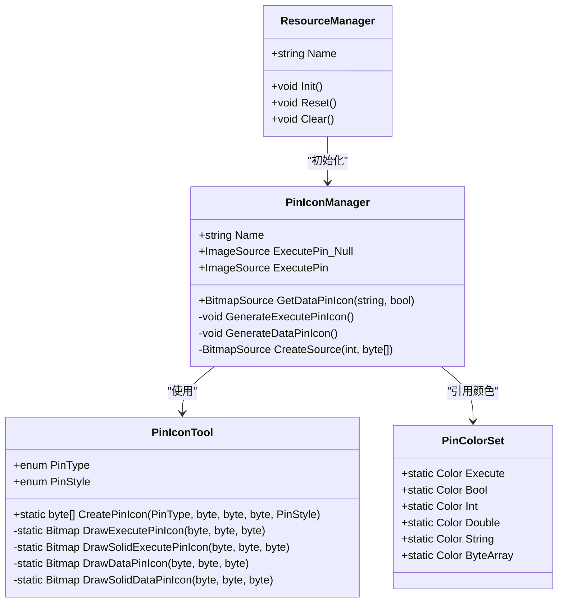
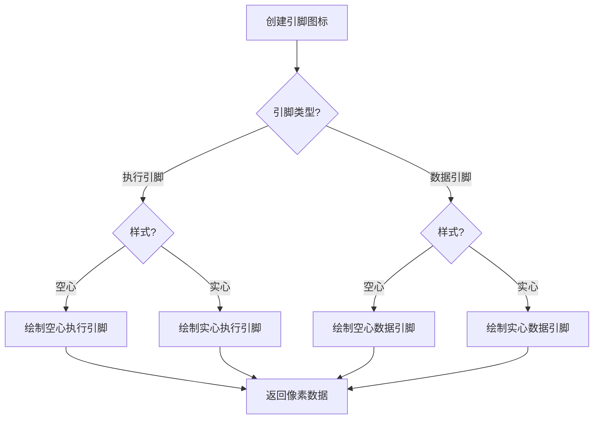
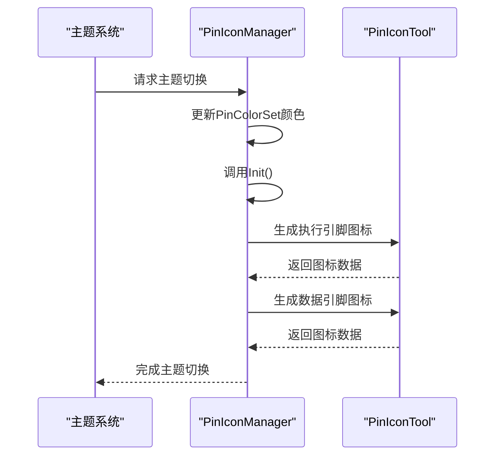
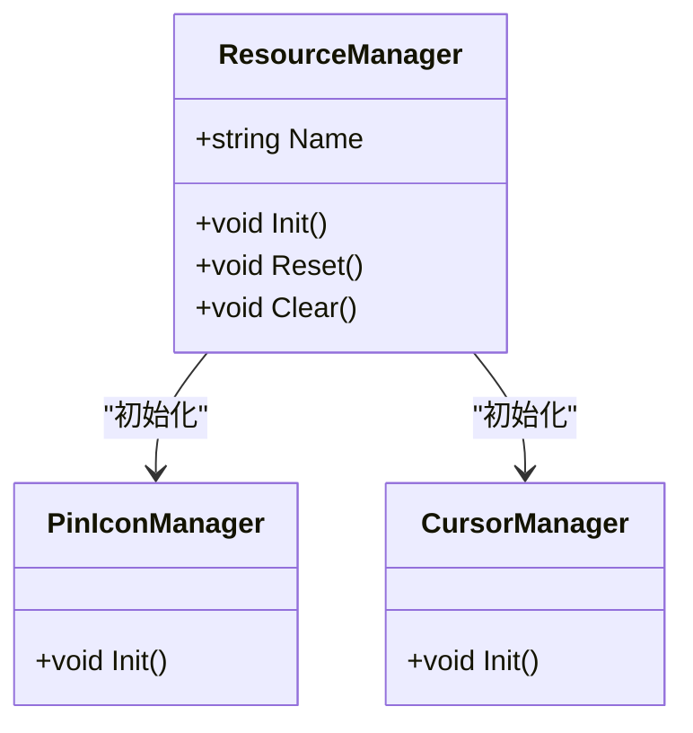
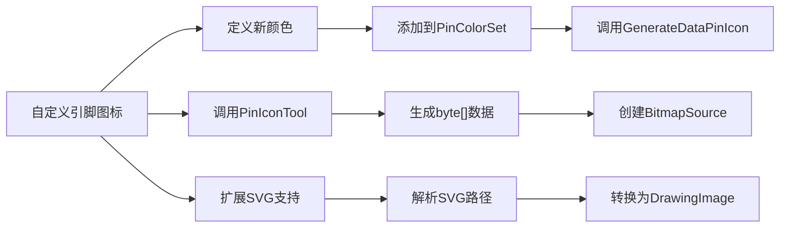

# 引脚图标管理

<cite>
**本文档引用的文件**
- [PinIconManager.cs](file://XNode/SubSystem/ResourceSystem/PinIconManager.cs)
- [PinIconTool.cs](file://XNode/SubSystem/ResourceSystem/PinIconTool.cs)
- [ResourceManager.cs](file://XNode/SubSystem/ResourceSystem/ResourceManager.cs)
- [PinColorSet.cs](file://XNode/SubSystem/NodeEditSystem/Define/PinColorSet.cs)
</cite>

## 目录
1. [引言](#引言)
2. [核心组件](#核心组件)
3. [图标映射机制](#图标映射机制)
4. [图标生成与尺寸适配](#图标生成与尺寸适配)
5. [主题切换与动态替换](#主题切换与动态替换)
6. [资源统一管理](#资源统一管理)
7. [自定义扩展接口](#自定义扩展接口)
8. [错误处理与调试](#错误处理与调试)

## 引言
引脚图标管理系统是XNode可视化编程框架中的关键视觉组件，负责管理节点编辑器中各类引脚（如数据、执行、控制）的图标显示。该系统通过程序化生成图标资源，支持基于引脚类型和状态的动态映射，并确保在不同DPI环境下清晰显示。本文档深入解析其架构设计与实现机制。

## 核心组件

引脚图标管理涉及多个核心类协同工作，形成完整的资源管理闭环。主要组件包括：
- **PinIconManager**：引脚图标管理器，负责图标资源的生成、存储与提供
- **PinIconTool**：图标生成工具，提供底层绘图能力
- **ResourceManager**：资源管理中枢，统一初始化所有资源管理器
- **PinColorSet**：引脚颜色定义集，提供标准化颜色方案

**图示来源**
- [PinIconManager.cs](file://XNode/SubSystem/ResourceSystem/PinIconManager.cs#L1-L110)
- [PinIconTool.cs](file://XNode/SubSystem/ResourceSystem/PinIconTool.cs#L1-L182)
- [ResourceManager.cs](file://XNode/SubSystem/ResourceSystem/ResourceManager.cs#L1-L36)
- [PinColorSet.cs](file://XNode/SubSystem/NodeEditSystem/Define/PinColorSet.cs#L1-L23)

**本节来源**
- [PinIconManager.cs](file://XNode/SubSystem/ResourceSystem/PinIconManager.cs#L1-L110)
- [PinIconTool.cs](file://XNode/SubSystem/ResourceSystem/PinIconTool.cs#L1-L182)

## 图标映射机制

引脚图标管理器基于引脚类型和状态构建了精细的图标映射体系。系统支持两种主要引脚类型：执行引脚（Execute）和数据引脚（Data），每种类型又根据填充状态分为实心（Solid）和空心（Hollow）样式。

对于数据引脚，系统采用字典结构 `_dataPinIconDict` 存储不同数据类型的图标，键名格式为 `{dataType}_{null|solid}`，例如 `"bool_null"` 表示布尔型空心引脚，`"int"` 表示整型实心引脚。执行引脚则通过两个独立属性 `ExecutePin_Null` 和 `ExecutePin` 分别管理空心与实心状态。

该映射机制在 `GenerateDataPinIcon` 方法中完成初始化，预生成所有支持的数据类型图标，确保运行时快速访问。

**本节来源**
- [PinIconManager.cs](file://XNode/SubSystem/ResourceSystem/PinIconManager.cs#L50-L109)

## 图标生成与尺寸适配

`PinIconTool` 类提供了核心的图标生成能力，通过程序化绘图创建11x11像素的引脚图标。系统支持两种引脚类型和两种样式，共四种基本图标形态：

**图示来源**
- [PinIconTool.cs](file://XNode/SubSystem/ResourceSystem/PinIconTool.cs#L45-L182)

所有图标统一生成为11x11像素，通过 `BitmapSource.Create` 方法创建具有96 DPI的 `BitmapSource` 对象，确保在WPF渲染管线中保持清晰显示。颜色参数通过 `PinColorSet` 提供的标准颜色转换为RGB值输入。

**本节来源**
- [PinIconTool.cs](file://XNode/SubSystem/ResourceSystem/PinIconTool.cs#L45-L182)
- [PinColorSet.cs](file://XNode/SubSystem/NodeEditSystem/Define/PinColorSet.cs#L1-L23)

## 主题切换与动态替换

尽管当前代码库中未发现显式的主题系统实现，但引脚图标管理架构已为动态主题切换提供了基础支持。通过 `PinColorSet` 静态类集中管理颜色定义，理论上可通过重新赋值这些静态属性来实现主题切换。

当需要切换主题时，可重新调用 `PinIconManager.Instance.Init()` 方法，该方法会重新生成所有引脚图标并应用新的颜色方案。由于图标是程序化生成而非静态资源文件，这种机制天然支持运行时动态更新。

**图示来源**
- [PinIconManager.cs](file://XNode/SubSystem/ResourceSystem/PinIconManager.cs#L35-L40)
- [PinIconTool.cs](file://XNode/SubSystem/ResourceSystem/PinIconTool.cs#L45-L182)

**本节来源**
- [PinIconManager.cs](file://XNode/SubSystem/ResourceSystem/PinIconManager.cs#L35-L40)

## 资源统一管理

`ResourceManager` 作为系统资源管理中枢，通过单例模式统一管理所有资源管理器的生命周期。其 `Init` 方法负责初始化包括 `PinIconManager` 在内的所有子资源管理器。

这种集中式管理确保了资源加载的有序性和一致性，避免了分散初始化可能导致的资源竞争或顺序依赖问题。当应用程序启动时，只需调用 `ResourceManager.Instance.Init()` 即可完成所有资源的准备。

**图示来源**
- [ResourceManager.cs](file://XNode/SubSystem/ResourceSystem/ResourceManager.cs#L1-L36)
- [PinIconManager.cs](file://XNode/SubSystem/ResourceSystem/PinIconManager.cs#L1-L110)

**本节来源**
- [ResourceManager.cs](file://XNode/SubSystem/ResourceSystem/ResourceManager.cs#L25-L30)

## 自定义扩展接口

系统提供了良好的扩展性支持，开发者可通过以下方式自定义引脚图标：

1. **扩展数据类型**：向 `PinColorSet` 添加新的静态颜色属性，并在 `PinIconManager.GenerateDataPinIcon` 中添加相应图标的生成代码
2. **自定义图标生成**：直接使用 `PinIconTool.CreatePinIcon` 方法生成符合特定需求的图标
3. **SVG转ImageSource**：虽然当前系统使用位图，但可通过WPF的 `SvgImageSource` 类扩展支持SVG格式

**本节来源**
- [PinIconTool.cs](file://XNode/SubSystem/ResourceSystem/PinIconTool.cs#L45-L182)
- [PinIconManager.cs](file://XNode/SubSystem/ResourceSystem/PinIconManager.cs#L75-L109)

## 错误处理与调试

当前系统在图标加载方面具有较高的可靠性，因为图标是程序化生成而非外部资源加载，避免了文件缺失等问题。然而，系统仍应考虑以下异常情况：

- **颜色值异常**：确保传入 `PinIconTool` 的RGB值在有效范围（0-255）
- **字典键冲突**：在 `_dataPinIconDict` 中添加新条目时检查键是否存在
- **内存管理**：`BitmapSource` 对象应妥善管理，避免内存泄漏

虽然代码中未显式实现调试日志输出，但建议在关键方法（如 `CreateSource`）中添加日志记录，便于追踪图标生成过程中的问题。

**本节来源**
- [PinIconManager.cs](file://XNode/SubSystem/ResourceSystem/PinIconManager.cs#L100-L109)
- [PinIconTool.cs](file://XNode/SubSystem/ResourceSystem/PinIconTool.cs#L45-L182)