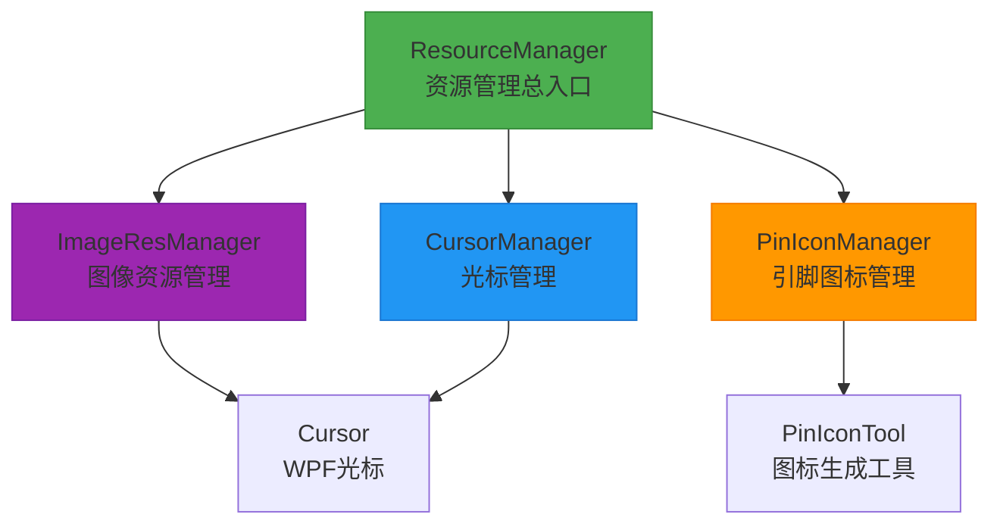
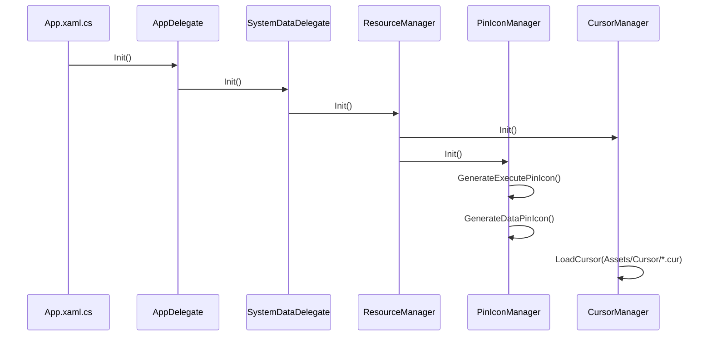
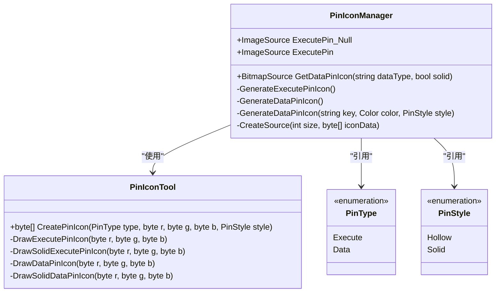
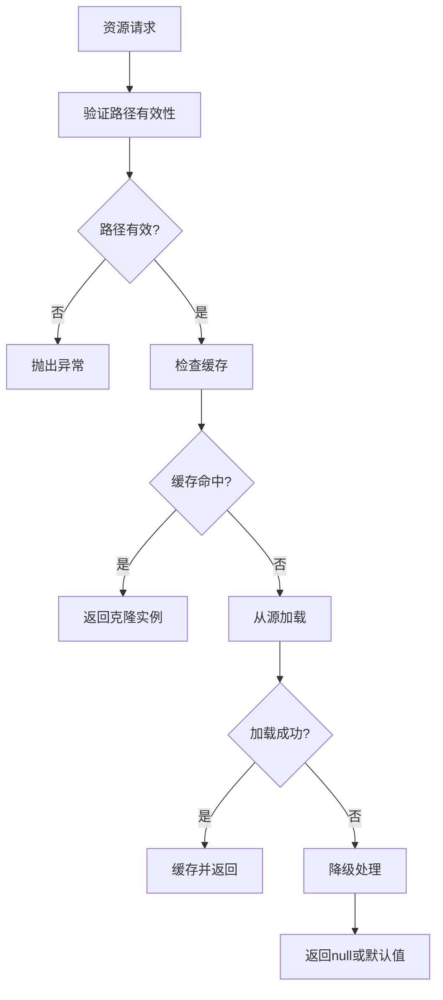

# 资源管理系统

<cite>
**本文档引用的文件**  
- [ResourceManager.cs](file://XNode/SubSystem/ResourceSystem/ResourceManager.cs)
- [ImageResManager.cs](file://XNode/SubSystem/ResourceSystem/ImageResManager.cs)
- [PinIconManager.cs](file://XNode/SubSystem/ResourceSystem/PinIconManager.cs)
- [PinIconTool.cs](file://XNode/SubSystem/ResourceSystem/PinIconTool.cs)
- [CursorManager.cs](file://XNode/SubSystem/ResourceSystem/CursorManager.cs)
- [SystemDelegate.cs](file://XNode/AppTool/SystemDelegate.cs)
- [App.xaml.cs](file://XNode/App.xaml.cs)
</cite>

## 目录
1. [简介](#简介)
2. [资源管理架构](#资源管理架构)
3. [ResourceManager 初始化流程](#resourcemanager-初始化流程)
4. [ImageResManager 图像资源管理](#imageresmanager-图像资源管理)
5. [PinIconManager 引脚图标管理](#piniconmanager-引脚图标管理)
6. [CursorManager 自定义光标管理](#cursormanager-自定义光标管理)
7. [资源引用最佳实践](#资源引用最佳实践)
8. [资源打包与路径配置](#资源打包与路径配置)
9. [资源加载失败降级策略](#资源加载失败降级策略)
10. [总结](#总结)

## 简介
本系统为XNode应用程序提供统一的资源管理机制，涵盖图像、图标、光标等各类UI资源。通过集中化的管理器设计，实现资源的高效加载、缓存复用和动态切换，确保应用程序在不同场景下的视觉一致性和性能表现。

## 资源管理架构
资源管理系统采用分层架构设计，以`ResourceManager`为总入口，协调多个专用资源管理器协同工作。各管理器职责分明，共同构成完整的资源服务体系。

**图示来源**  
- [ResourceManager.cs](file://XNode/SubSystem/ResourceSystem/ResourceManager.cs#L4-L34)
- [CursorManager.cs](file://XNode/SubSystem/ResourceSystem/CursorManager.cs#L9-L95)
- [PinIconManager.cs](file://XNode/SubSystem/ResourceSystem/PinIconManager.cs#L9-L108)
- [ImageResManager.cs](file://XNode/SubSystem/ResourceSystem/ImageResManager.cs#L5-L96)

**本节来源**  
- [ResourceManager.cs](file://XNode/SubSystem/ResourceSystem/ResourceManager.cs#L4-L34)
- [SystemDelegate.cs](file://XNode/AppTool/SystemDelegate.cs#L32-L46)

## ResourceManager 初始化流程
`ResourceManager`作为资源管理的总入口，采用单例模式实现，通过`Init()`方法协调各子管理器的初始化。其初始化流程是应用程序启动过程中的关键环节。

**图示来源**  
- [App.xaml.cs](file://XNode/App.xaml.cs#L25-L60)
- [SystemDelegate.cs](file://XNode/AppTool/SystemDelegate.cs#L32-L46)
- [ResourceManager.cs](file://XNode/SubSystem/ResourceSystem/ResourceManager.cs#L4-L34)
- [PinIconManager.cs](file://XNode/SubSystem/ResourceSystem/PinIconManager.cs#L9-L108)
- [CursorManager.cs](file://XNode/SubSystem/ResourceSystem/CursorManager.cs#L9-L95)

**本节来源**  
- [ResourceManager.cs](file://XNode/SubSystem/ResourceSystem/ResourceManager.cs#L4-L34)
- [SystemDelegate.cs](file://XNode/AppTool/SystemDelegate.cs#L32-L46)
- [App.xaml.cs](file://XNode/App.xaml.cs#L25-L60)

## ImageResManager 图像资源管理
`ImageResManager`负责统一管理应用程序中的所有图像资源，通过内存缓存机制实现资源的高效复用，避免重复加载造成的性能损耗。

### 缓存机制
该管理器使用`Dictionary<string, BitmapImage>`作为缓存容器，以资源路径为键存储已加载的图像实例。当请求图像时，首先检查缓存中是否存在，若存在则直接返回克隆实例，否则从指定路径加载并缓存。

### 资源加载方法
管理器提供多种便捷方法用于加载不同类型的图像资源：

| 方法名 | 功能描述 | 资源路径示例 |
|--------|--------|------------|
| `GetImage(path)` | 通用图像加载 | 绝对路径或pack://格式 |
| `GetAssetsImage(path)` | 加载Assets目录资源 | pack://application:,,,/Assets/{path} |
| `GetNodeIcon(iconName)` | 加载节点图标 | pack://application:,,,/Assets/Icon16/Node/{iconName}.png |
| `GetIcon15(path)` | 加载15x15小图标 | pack://application:,,,/Assets/Icon15/{path} |
| `GetImageFont(path)` | 加载字体图像 | pack://application:,,,/Assets/Font/Number/{path} |
| `GetSubSystemImage(...)` | 加载子系统图像 | pack://application:,,,/SubSystem/{subSystem}/Image/{imageName}.png |

**图示来源**  
- [ImageResManager.cs](file://XNode/SubSystem/ResourceSystem/ImageResManager.cs#L5-L96)

**本节来源**  
- [ImageResManager.cs](file://XNode/SubSystem/ResourceSystem/ImageResManager.cs#L5-L96)

## PinIconManager 引脚图标管理
`PinIconManager`专门负责管理节点编辑器中的引脚图标，支持执行引脚和数据引脚的分类管理，并提供主题切换和尺寸适配能力。

### 分类管理机制
管理器通过枚举`PinType`区分执行引脚和数据引脚，通过`PinStyle`区分空心和实心样式。初始化时预生成所有标准引脚图标并存储在内存中。

**图示来源**  
- [PinIconManager.cs](file://XNode/SubSystem/ResourceSystem/PinIconManager.cs#L9-L108)
- [PinIconTool.cs](file://XNode/SubSystem/ResourceSystem/PinIconTool.cs#L0-L181)

### 图标生成流程
引脚图标通过`PinIconTool`在内存中动态生成，而非从文件加载。该工具使用`XLib.Drawing`库直接绘制像素级图标，支持颜色参数化配置，便于主题切换。

**本节来源**  
- [PinIconManager.cs](file://XNode/SubSystem/ResourceSystem/PinIconManager.cs#L9-L108)
- [PinIconTool.cs](file://XNode/SubSystem/ResourceSystem/PinIconTool.cs#L0-L181)

## CursorManager 自定义光标管理
`CursorManager`实现自定义光标的动态切换，支持多种操作模式下的光标显示，提升用户交互体验。

### 光标类型
管理器预定义了13种常用光标类型，涵盖选择、移动、绘制、禁止等操作场景：

- 选择 (`Select`)
- 选择并移动 (`SelectAndMove`)
- 移动 (`Move`)
- 水平移动 (`MoveX`)
- 垂直移动 (`MoveY`)
- 十字 (`Cross`)
- 插入 (`Insert`)
- 绘制 (`Draw`)
- 禁止 (`Disable`)
- 移至顶端 (`MoveTop`)
- 移至底端 (`MoveBottom`)
- 缩放：左上至右下 (`ResizeUpDown`)
- 缩放：左下至右上 (`ResizeDownUp`)
- 开关 (`OnOff`)

### 动态切换机制
通过`LoadCursor`私有方法从`Assets/Cursor/`目录加载`.cur`文件，创建`Cursor`实例并赋值给对应属性。应用程序可根据当前操作模式动态切换光标。

**图示来源**  
- [CursorManager.cs](file://XNode/SubSystem/ResourceSystem/CursorManager.cs#L9-L95)

**本节来源**  
- [CursorManager.cs](file://XNode/SubSystem/ResourceSystem/CursorManager.cs#L9-L95)

## 资源引用最佳实践
为避免内存泄漏和资源浪费，应遵循以下资源引用最佳实践：

1. **使用管理器接口**：始终通过`ResourceManager.Instance`等单例访问资源，避免直接创建资源实例
2. **及时释放引用**：在WPF绑定场景中，注意清理事件处理程序和数据绑定
3. **避免重复加载**：利用管理器的缓存机制，相同资源路径应返回缓存实例
4. **异常处理**：对资源加载操作进行异常捕获，特别是文件路径验证
5. **资源路径规范**：使用统一的路径格式，推荐使用pack://协议加载嵌入资源

**本节来源**  
- [ImageResManager.cs](file://XNode/SubSystem/ResourceSystem/ImageResManager.cs#L5-L96)
- [CursorManager.cs](file://XNode/SubSystem/ResourceSystem/CursorManager.cs#L9-L95)

## 资源打包与路径配置
系统采用WPF的资源打包机制，将各类资源嵌入程序集，确保部署的便捷性和资源的安全性。

### 资源路径规范
| 资源类型 | 路径格式 | 示例 |
|---------|---------|------|
| 通用资源 | pack://application:,,,/{path} | pack://application:,,,/Assets/logo.png |
| 节点图标 | pack://application:,,,/Assets/Icon16/Node/{name}.png | pack://application:,,,/Assets/Icon16/Node/Logic.png |
| 小图标 | pack://application:,,,/Assets/Icon15/{path} | pack://application:,,,/Assets/Icon15/file.png |
| 子系统图像 | pack://application:,,,/SubSystem/{system}/Image/{name}.png | pack://application:,,,/SubSystem/NodeLib/Image/icon.png |
| 光标文件 | Assets/Cursor/{name}.cur | Assets/Cursor/Select.cur |

### 配置建议
- 将资源文件设置为"资源"或"内容"生成操作
- 使用相对路径引用资源
- 对频繁使用的资源进行预加载
- 在调试版本中验证资源路径的正确性

**本节来源**  
- [ImageResManager.cs](file://XNode/SubSystem/ResourceSystem/ImageResManager.cs#L5-L96)
- [CursorManager.cs](file://XNode/SubSystem/ResourceSystem/CursorManager.cs#L9-L95)

## 资源加载失败降级策略
系统实现了多层次的资源加载失败处理机制，确保应用程序的健壮性。

### 降级处理流程

### 具体策略
1. **路径验证**：在加载前验证路径非空且文件存在（非pack://资源）
2. **异常捕获**：对`BitmapImage`初始化过程中的异常进行捕获
3. **返回默认值**：对于可选资源，返回`null`或默认图像
4. **日志记录**：记录资源加载失败信息，便于调试
5. **用户提示**：在关键资源加载失败时显示友好提示

**本节来源**  
- [ImageResManager.cs](file://XNode/SubSystem/ResourceSystem/ImageResManager.cs#L5-L96)
- [CursorManager.cs](file://XNode/SubSystem/ResourceSystem/CursorManager.cs#L9-L95)

## 总结
XNode的资源管理系统通过模块化设计实现了各类UI资源的统一管理。`ResourceManager`作为总入口协调`ImageResManager`、`PinIconManager`和`CursorManager`三个核心组件，分别负责图像、引脚图标和光标的管理。系统采用内存缓存、动态生成、预加载等技术手段，在保证性能的同时提供了灵活的资源管理能力。通过遵循最佳实践和合理的降级策略，确保了应用程序在各种场景下的稳定运行。