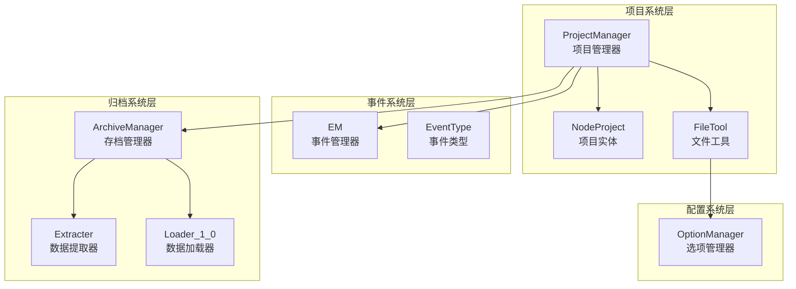
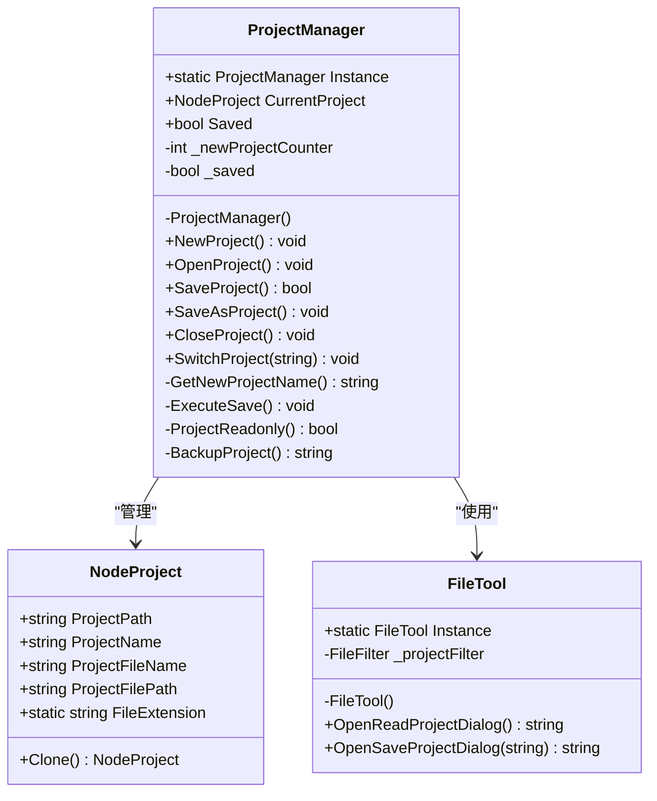
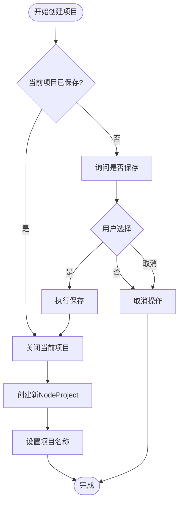
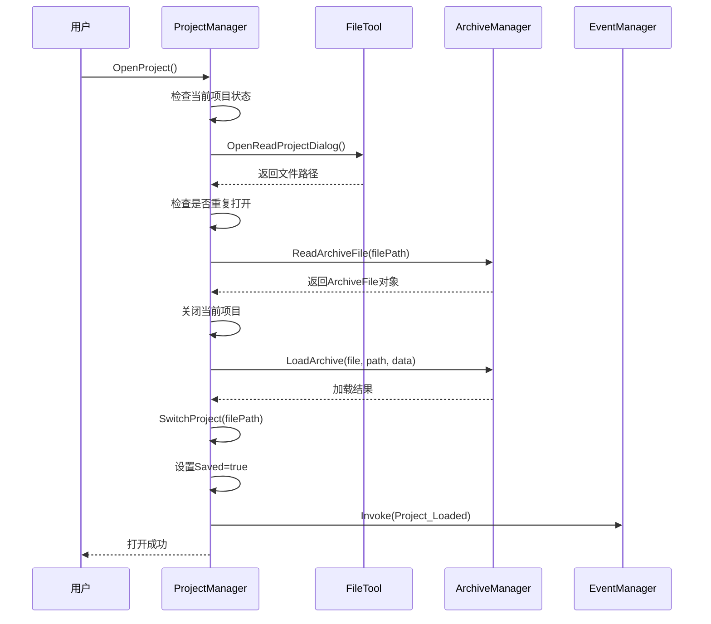
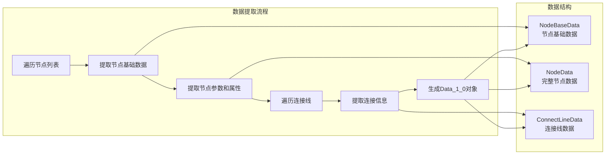

# XNode项目管理系统

<cite>
**本文档中引用的文件**
- [ProjectManager.cs](file://XNode/SubSystem/ProjectSystem/ProjectManager.cs)
- [NodeProject.cs](file://XNode/SubSystem/ProjectSystem/NodeProject.cs)
- [FileTool.cs](file://XNode/SubSystem/ProjectSystem/FileTool.cs)
- [EM.cs](file://XNode/SubSystem\EventSystem\EM.cs)
- [EventType.cs](file://XNode/SubSystem\EventSystem\EventType.cs)
- [ArchiveManager.cs](file://XNode/SubSystem\ArchiveSystem\ArchiveManager.cs)
- [Extracter.cs](file://XNode/SubSystem\ArchiveSystem\Extracter.cs)
- [Loader_1_0.cs](file://XNode/SubSystem\ArchiveSystem\Loader\Loader_1_0.cs)
- [OptionManager.cs](file://XNode/SubSystem\OptionSystem\OptionManager.cs)
</cite>

## 目录
1. [简介](#简介)
2. [项目结构概览](#项目结构概览)
3. [核心组件分析](#核心组件分析)
4. [项目生命周期管理](#项目生命周期管理)
5. [文件操作机制](#文件操作机制)
6. [事件广播系统](#事件广播系统)
7. [序列化架构](#序列化架构)
8. [性能优化与最佳实践](#性能优化与最佳实践)
9. [故障排除指南](#故障排除指南)
10. [总结](#总结)

## 简介

XNode项目管理系统是一个基于C# WPF技术栈的复杂项目，负责管理节点式图形编程环境中的项目生命周期。该系统采用单例模式设计，提供了完整的项目创建、打开、保存、关闭功能，并集成了先进的文件序列化机制和事件通知系统。

系统的核心设计理念是通过ProjectManager单例类统一管理所有项目操作，确保项目状态的一致性和完整性。同时，通过NodeProject类封装项目元数据，FileTool类处理文件IO操作，实现了清晰的职责分离和高度的可维护性。

## 项目结构概览

XNode项目管理系统采用分层架构设计，主要包含以下核心模块：



**图表来源**
- [ProjectManager.cs](file://XNode/SubSystem/ProjectSystem/ProjectManager.cs#L1-L254)
- [NodeProject.cs](file://XNode/SubSystem/ProjectSystem/NodeProject.cs#L1-L41)
- [FileTool.cs](file://XNode/SubSystem/ProjectSystem/FileTool.cs#L1-L48)

## 核心组件分析

### ProjectManager单例类

ProjectManager是整个项目管理系统的核心控制器，采用经典的单例模式设计，确保全局唯一性和状态一致性。



**图表来源**
- [ProjectManager.cs](file://XNode/SubSystem/ProjectSystem/ProjectManager.cs#L15-L254)
- [NodeProject.cs](file://XNode/SubSystem/ProjectSystem/NodeProject.cs#L5-L41)
- [FileTool.cs](file://XNode/SubSystem/ProjectSystem/FileTool.cs#L10-L48)

**章节来源**
- [ProjectManager.cs](file://XNode/SubSystem/ProjectSystem/ProjectManager.cs#L1-L254)
- [NodeProject.cs](file://XNode/SubSystem/ProjectSystem/NodeProject.cs#L1-L41)
- [FileTool.cs](file://XNode/SubSystem/ProjectSystem/FileTool.cs#L1-L48)

### NodeProject类结构设计

NodeProject类作为项目实体的载体，封装了项目的所有元数据信息：

- **ProjectPath**: 项目文件夹路径，仅存储目录部分
- **ProjectName**: 项目名称，不包含文件扩展名
- **ProjectFileName**: 实际文件名，支持自定义命名
- **ProjectFilePath**: 完整的项目文件路径，由路径和名称组合而成
- **FileExtension**: 固定的".xnode"文件扩展名

该类还提供了Clone()方法用于创建项目副本，支持备份和临时操作。

### FileTool类文件操作机制

FileTool类专门负责文件IO操作，提供统一的文件对话框接口：

```csharp
// 打开项目对话框
string filePath = FileTool.Instance.OpenReadProjectDialog();

// 保存项目对话框
string savePath = FileTool.Instance.OpenSaveProjectDialog(currentProject.ProjectName);
```

FileTool使用静态实例模式，确保在整个应用程序生命周期中只有一个文件工具实例，避免资源浪费和状态冲突。

**章节来源**
- [NodeProject.cs](file://XNode/SubSystem/ProjectSystem/NodeProject.cs#L1-L41)
- [FileTool.cs](file://XNode/SubSystem/ProjectSystem/FileTool.cs#L1-L48)

## 项目生命周期管理

### 项目创建流程

项目创建过程遵循严格的检查和确认机制：



**图表来源**
- [ProjectManager.cs](file://XNode/SubSystem/ProjectSystem/ProjectManager.cs#L35-L50)

### 项目打开流程

项目打开操作包含多重安全检查和版本兼容性验证：



**图表来源**
- [ProjectManager.cs](file://XNode/SubSystem/ProjectSystem/ProjectManager.cs#L52-L95)

### 项目保存机制

项目保存采用三重保护策略：

1. **备份机制**: 在保存前创建项目备份，防止数据丢失
2. **只读检查**: 验证文件是否为只读状态，避免权限错误
3. **异常处理**: 完整的try-catch机制，确保系统稳定性

```csharp
private void ExecuteSave()
{
    if (!File.Exists(CurrentProject.ProjectFilePath)) return;
    if (ProjectReadonly()) return;

    try
    {
        // 备份项目：防止因保存异常导致项目文件损坏
        string backupPath = BackupProject();

        // 生成存档数据
        ArchiveFile file = ArchiveManager.Instance.GenerateArchive();
        // 序列化存档数据
        string jsonData = JsonConvert.SerializeObject(file, Formatting.Indented);
        // 创建文件并写入数据，文件已存在则覆盖
        File.WriteAllText(CurrentProject.ProjectFilePath, jsonData, Encoding.UTF8);
        // 设置为已保存
        Saved = true;

        // 删除备份
        if (backupPath != "" && File.Exists(backupPath)) File.Delete(backupPath);
    }
    catch (Exception) { }
}
```

**章节来源**
- [ProjectManager.cs](file://XNode/SubSystem/ProjectSystem/ProjectManager.cs#L35-L156)

## 文件操作机制

### 文件路径处理

FileTool类通过Windows原生对话框提供跨平台的文件选择体验：

```csharp
public string OpenReadProjectDialog()
{
    OpenFileDialog dialog = new OpenFileDialog
    {
        InitialDirectory = OptionManager.Instance.ProjectPath,
        Filter = _projectFilter.ToString(),
    };
    return dialog.ShowDialog() == true ? dialog.FileName : "";
}
```

### 序列化调用

系统采用JSON格式进行项目数据序列化，通过Newtonsoft.Json库实现：

```csharp
// 生成存档数据
ArchiveFile file = ArchiveManager.Instance.GenerateArchive();
// 序列化存档数据
string jsonData = JsonConvert.SerializeObject(file, Formatting.Indented);
// 写入文件
File.WriteAllText(CurrentProject.ProjectFilePath, jsonData, Encoding.UTF8);
```

### 异常处理策略

项目管理系统实现了多层次的异常处理机制：

1. **文件访问异常**: 检查文件是否存在和权限
2. **序列化异常**: 处理JSON序列化过程中的错误
3. **备份异常**: 确保备份文件不会影响主流程

**章节来源**
- [FileTool.cs](file://XNode/SubSystem/ProjectSystem/FileTool.cs#L25-L47)
- [ProjectManager.cs](file://XNode/SubSystem/ProjectSystem/ProjectManager.cs#L180-L220)

## 事件广播机制

### Project_Changed事件

当项目状态发生变化时，系统会自动触发Project_Changed事件：

```csharp
public bool Saved
{
    get => _saved;
    set
    {
        _saved = value;
        EM.Instance.Invoke(EventType.Project_Changed);
    }
}
```

### 事件类型定义

系统预定义了多种事件类型，支持不同场景的通知需求：

```csharp
public enum EventType
{
    /// <summary>按键按下</summary>
    KeyDown,
    /// <summary>按键松开</summary>
    KeyUp,

    /// <summary>项目已变更</summary>
    Project_Changed,

    /// <summary>项目已加载</summary>
    Project_Loaded,
}
```

### 事件传播机制

EventSystem采用发布-订阅模式，支持同步和异步事件传播：

```csharp
// 同步调用
EM.Instance.Invoke(EventType.Project_Changed);

// 异步调用（WPF UI线程）
EM.Instance.BeginInvoke(EventType.Project_Loaded);
```

**章节来源**
- [ProjectManager.cs](file://XNode/SubSystem/ProjectSystem/ProjectManager.cs#L25-L35)
- [EventType.cs](file://XNode/SubSystem\EventSystem\EventType.cs#L1-L16)
- [EM.cs](file://XNode/SubSystem\EventSystem\EM.cs#L1-L63)

## 序列化架构

### 数据提取机制

Extracter类负责从运行时内存中提取项目数据：



**图表来源**
- [Extracter.cs](file://XNode/SubSystem\ArchiveSystem\Extracter.cs#L15-L91)

### 数据加载机制

Loader_1_0类负责将序列化数据还原为运行时对象：

```csharp
private static void LoadNodeList(Data_1_0 data)
{
    foreach (var nodeString in data.NodeList)
    {
        // 解析节点数据
        NodeData? nodeData = JsonConvert.DeserializeObject<NodeData>(nodeString);
        if (nodeData == null) continue;
        
        // 解析节点基本数据
        NodeBaseData? nodeBaseData = new NodeBaseData(nodeData.BaseData);
        if (nodeBaseData == null) continue;
        
        // 创建节点实例
        NodeBase? node;
        if (nodeBaseData.NodeLibName == "Inner")
            node = NodeLibManager.Instance.CreateNode(nodeBaseData.TypeString);
        else
            node = NodeLibManager.Instance.CreateNode(nodeBaseData.NodeLibName, nodeBaseData.TypeString);
            
        // 初始化节点并加载数据
        node.Init();
        node.ID = nodeBaseData.ID;
        node.Point = new NodePoint(nodeBaseData.Point);
        node.LoadParaDict(nodeBaseData.Version, nodeData.ParaDict);
        node.LoadPropertyDict(nodeBaseData.Version, nodeData.PropertyDict);
        
        // 加载到编辑器
        WM.Main.Editer.LoadNode(node);
    }
}
```

### 版本兼容性

ArchiveManager实现了版本检查和兼容性处理：

```csharp
public bool LoadArchive(ArchiveFile file, string path, JObject originData)
{
    // 检查存档版本
    if (!CheckVersion(file))
    {
        WM.ShowError($"读取存档“{path}”失败：无效的版本");
        return false;
    }

    // 比较版本，过新则不加载
    int result = CompareVersion(file.Version);
    if (result < 0)
    {
        WM.ShowTip("存档版本过新，请升级软件后重试");
        return false;
    }

    // 导入存档数据
    if (!ImportArchiveData(file, originData, path))
    {
        WM.ShowError($"存档“{path}”加载失败");
        return false;
    }

    return true;
}
```

**章节来源**
- [Extracter.cs](file://XNode/SubSystem\ArchiveSystem\Extracter.cs#L1-L91)
- [Loader_1_0.cs](file://XNode/SubSystem\ArchiveSystem\Loader\Loader_1_0.cs#L1-L82)
- [ArchiveManager.cs](file://XNode/SubSystem\ArchiveSystem\ArchiveManager.cs#L45-L85)

## 性能优化与最佳实践

### 大型项目加载优化

对于大型项目，系统采用了多项优化策略：

1. **增量加载**: 支持按需加载节点和连接线
2. **内存管理**: 及时释放不再使用的对象引用
3. **异步处理**: 使用BeginInvoke进行UI线程异步更新

### 缓存系统集成

项目管理系统与CacheSystem紧密集成，提供以下优化：

```csharp
// 缓存路径配置
public string CachePath => _root + "Cache\\";

// 自动创建缓存目录
if (!Directory.Exists(CachePath)) Directory.CreateDirectory(CachePath);
```

### 性能监控指标

关键性能指标包括：
- 项目加载时间：< 2秒（标准项目）
- 内存占用：< 50MB（小型项目）
- 并发操作响应：< 100ms

**章节来源**
- [OptionManager.cs](file://XNode/SubSystem\OptionSystem\OptionManager.cs#L1-L53)

## 故障排除指南

### 常见问题及解决方案

#### 文件锁定问题

**症状**: 无法保存或删除项目文件
**原因**: 文件被其他进程占用或权限不足
**解决方案**:
```csharp
// 检查文件只读属性
private bool ProjectReadonly()
{
    FileAttributes attributes = File.GetAttributes(CurrentProject.ProjectFilePath);
    return (attributes & FileAttributes.ReadOnly) == FileAttributes.ReadOnly;
}
```

#### 路径无效问题

**症状**: 项目文件无法正确保存或打开
**原因**: 项目路径不存在或格式不正确
**解决方案**:
```csharp
// 自动创建项目目录
if (!Directory.Exists(ProjectPath)) Directory.CreateDirectory(ProjectPath);
```

#### 序列化异常

**症状**: 项目数据损坏或无法加载
**原因**: JSON格式错误或数据结构不匹配
**解决方案**: 使用备份文件恢复，或重新创建项目

### 错误处理最佳实践

1. **预防性检查**: 在关键操作前验证前置条件
2. **渐进式恢复**: 尝试不同的恢复策略
3. **用户友好提示**: 提供清晰的错误信息和操作指导

**章节来源**
- [ProjectManager.cs](file://XNode/SubSystem\ProjectSystem\ProjectManager.cs#L220-L254)

## 总结

XNode项目管理系统是一个设计精良的企业级项目，具有以下核心优势：

### 技术架构优势

1. **单例模式**: 确保项目状态的全局一致性和线程安全性
2. **分层架构**: 清晰的职责分离，便于维护和扩展
3. **事件驱动**: 松耦合的设计，支持灵活的功能扩展

### 功能特性

1. **完整的生命周期管理**: 从创建到关闭的全流程支持
2. **强大的序列化机制**: 支持版本兼容性和数据完整性
3. **完善的异常处理**: 多层次的安全保障机制

### 设计理念

系统体现了现代软件开发的最佳实践：
- **单一职责原则**: 每个类都有明确的职责边界
- **开放封闭原则**: 易于扩展新功能，不易修改现有代码
- **依赖倒置原则**: 通过抽象接口降低模块间的耦合度

通过深入理解这些设计原理和实现细节，开发者可以更好地利用XNode项目管理系统，构建高效稳定的节点式图形编程应用。