# 节点系统开发指南

<cite>
**本文档中引用的文件**  
- [NodeBase.cs](file://XLib.Node/NodeBase.cs)
- [PinBase.cs](file://XLib.Node/PinBase.cs)
- [NodeType.cs](file://XLib.Node/NodeType.cs)
- [FileNode.cs](file://NodeLib.File/Define/FileNode.cs)
- [Func_GetFileMD5.cs](file://NodeLib.File/Define/Func_GetFileMD5.cs)
- [Func_Log.cs](file://XNode/SubSystem/NodeLibSystem/Define/Functions/Func_Log.cs)
- [Func_Delay.cs](file://XNode/SubSystem/NodeLibSystem/Define/Functions/Func_Delay.cs)
- [NodeLibManager.cs](file://XNode/SubSystem/NodeLibSystem/NodeLibManager.cs)
- [INodeLib.cs](file://XLib.Node/INodeLib.cs)
</cite>

## 目录
1. [引言](#引言)
2. [核心架构概览](#核心架构概览)
3. [节点基础类设计](#节点基础类设计)
4. [引脚系统实现](#引脚系统实现)
5. [节点类型注册机制](#节点类型注册机制)
6. [文件操作节点实现](#文件操作节点实现)
7. [标准功能节点构造](#标准功能节点构造)
8. [节点库管理机制](#节点库管理机制)
9. [自定义节点开发流程](#自定义节点开发流程)
10. [常见错误与调试](#常见错误与调试)

## 引言
XNode 是一个基于节点的可视化编程系统，允许开发者通过继承 `NodeBase` 类创建自定义节点来扩展系统功能。本指南详细说明了如何开发自定义节点，包括节点定义、引脚配置、执行逻辑实现、类型注册和库管理等关键环节。通过分析 `NodeLib.File` 和 `NodeLib.System` 中的具体实现，为开发者提供完整的开发参考。

## 核心架构概览
XNode 的节点系统采用模块化设计，核心组件包括节点基类、引脚系统、节点类型管理和节点库管理。系统通过 `NodeLibManager` 统一管理内置和外部节点库，支持动态加载和注册。节点通过引脚连接形成数据流和控制流，实现复杂的功能组合。

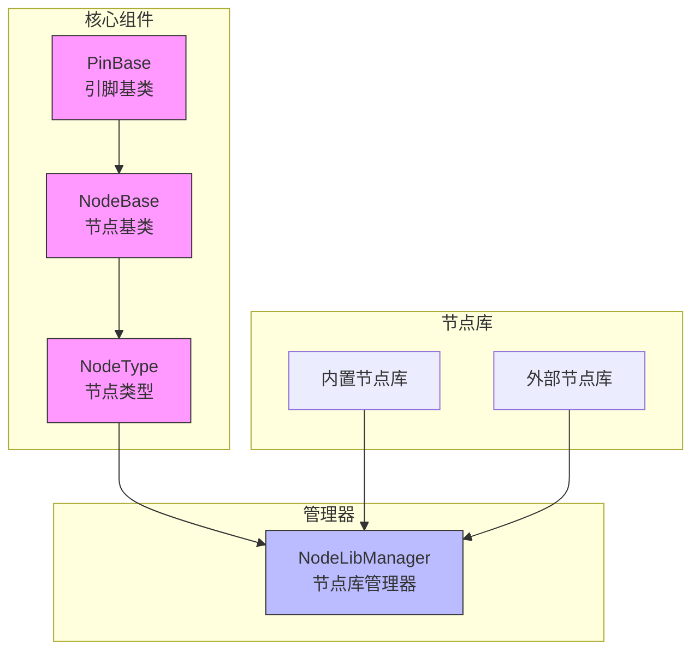

**图示来源**  
- [NodeBase.cs](file://XLib.Node/NodeBase.cs#L1-L50)
- [PinBase.cs](file://XLib.Node/PinBase.cs#L1-L20)
- [NodeType.cs](file://XLib.Node/NodeType.cs#L1-L15)
- [NodeLibManager.cs](file://XNode/SubSystem/NodeLibSystem/NodeLibManager.cs#L1-L30)

## 节点基础类设计
`NodeBase` 类是所有节点的基类，定义了节点的基本属性、生命周期方法和核心功能。开发者需要继承此类并实现必要的抽象方法来创建自定义节点。

### 核心属性
- **NodeLibName**: 节点所属库名称
- **TypeID**: 类型编号
- **Version**: 版本号
- **ID**: 实例编号
- **Point**: 节点坐标
- **Color**: 节点颜色
- **Icon**: 图标标识
- **Title**: 节点标题

### 生命周期方法
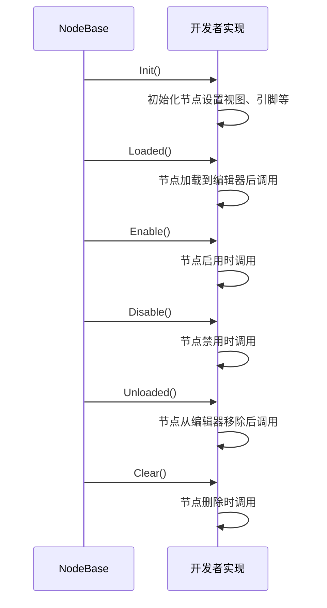

**图示来源**  
- [NodeBase.cs](file://XLib.Node/NodeBase.cs#L100-L150)

**本节来源**  
- [NodeBase.cs](file://XLib.Node/NodeBase.cs#L1-L418)

## 引脚系统实现
引脚系统是节点间通信的基础，分为执行引脚和数据引脚两种类型，通过 `PinBase` 及其派生类实现。

### 引脚基类结构
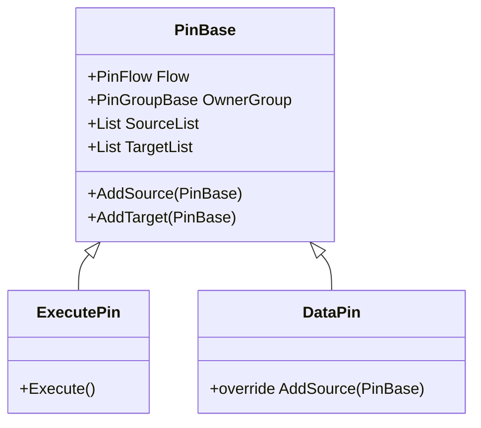

**图示来源**  
- [PinBase.cs](file://XLib.Node/PinBase.cs#L1-L80)

### 引脚组管理
节点通过 `PinGroupList` 管理引脚组，每个引脚组包含输入和输出引脚。常见的引脚组类型包括：
- `ExecutePinGroup`: 执行控制引脚组
- `DataPinGroup`: 数据引脚组
- `TDataPinGroup<T>`: 泛型数据引脚组

**本节来源**  
- [PinBase.cs](file://XLib.Node/PinBase.cs#L1-L80)
- [NodeBase.cs](file://XLib.Node/NodeBase.cs#L1-L418)

## 节点类型注册机制
`NodeType<T>` 泛型类实现了节点类型的注册和实例化机制，通过反射创建节点实例。

### 类型注册原理
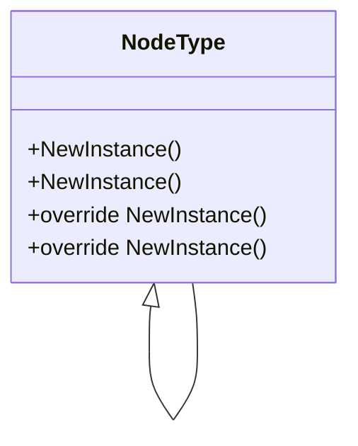

**图示来源**  
- [NodeType.cs](file://XLib.Node/NodeType.cs#L1-L40)

### 泛型机制工作流程
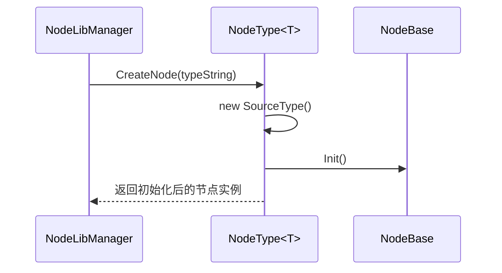

**图示来源**  
- [NodeType.cs](file://XLib.Node/NodeType.cs#L1-L40)
- [NodeLibManager.cs](file://XNode/SubSystem/NodeLibSystem/NodeLibManager.cs#L1-L30)

**本节来源**  
- [NodeType.cs](file://XLib.Node/NodeType.cs#L1-L40)

## 文件操作节点实现
`NodeLib.File` 提供了文件操作相关的节点实现，通过 `FileNode` 基类和具体功能节点展示文件操作类节点的构造模式。

### 文件节点基类
`FileNode` 类继承自 `NodeBase`，为文件操作节点提供统一的库标识：

```csharp
public abstract class FileNode : NodeBase
{
    public FileNode() => NodeLibName = "File";
    
    public override Dictionary<string, string> GetParaDict() => new Dictionary<string, string>();
}
```

**本节来源**  
- [FileNode.cs](file://NodeLib.File/Define/FileNode.cs#L1-L11)

### 文件MD5计算节点
`Func_GetFileMD5` 节点演示了完整的文件操作节点实现：

#### 节点结构
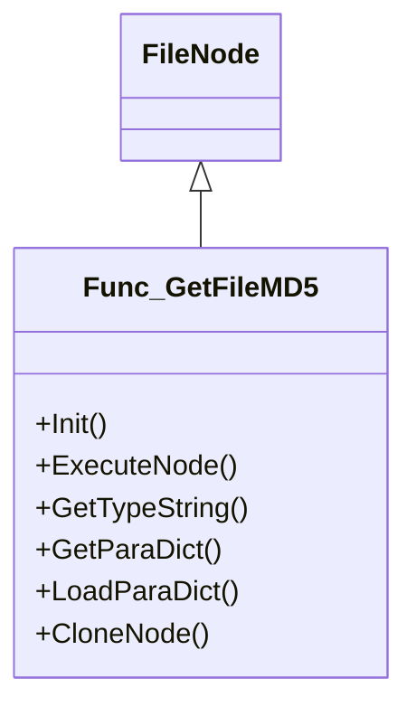

#### 执行流程
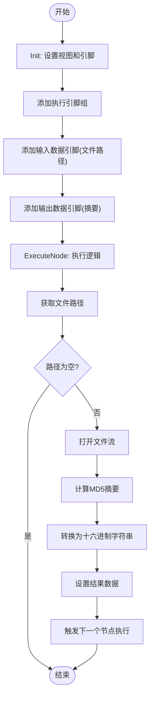

**图示来源**  
- [Func_GetFileMD5.cs](file://NodeLib.File/Define/Func_GetFileMD5.cs#L1-L71)

**本节来源**  
- [FileNode.cs](file://NodeLib.File/Define/FileNode.cs#L1-L11)
- [Func_GetFileMD5.cs](file://NodeLib.File/Define/Func_GetFileMD5.cs#L1-L71)

## 标准功能节点构造
`NodeLib.System` 中的标准功能节点展示了通用节点的构造模式，包括日志输出和延迟执行等常用功能。

### 日志节点实现
`Func_Log` 节点实现控制台日志输出功能：

#### 节点配置
```csharp
SetViewProperty(NodeColorSet.Function, "Function", "日志");
PinGroupList.Add(new ExecutePinGroup(this, "发送消息至控制台"));
PinGroupList.Add(new DataPinGroup(this, "string", "消息", "Message") { BoxWidth = 180, Readable = false });
```

#### 执行逻辑
```csharp
protected override void ExecuteNode()
{
    ((DataPinGroup)PinGroupList[1]).UpdateValue();
    Console.WriteLine(((DataPinGroup)PinGroupList[1]).Value);
    ((ExecutePinGroup)PinGroupList[0]).Execute();
}
```

**本节来源**  
- [Func_Log.cs](file://XNode/SubSystem/NodeLibSystem/Define/Functions/Func_Log.cs#L1-L42)

### 延迟执行节点
`Func_Delay` 节点实现异步延迟执行功能：

#### 异步执行
```csharp
protected override async void ExecuteNode()
{
    await Task.Delay(int.Parse(GetData(1)));
    GetPinGroup<ExecutePinGroup>().Execute();
}
```

#### 参数管理
```csharp
public override Dictionary<string, string> GetParaDict()
{
    return new Dictionary<string, string> { { "Time", GetData(1) } };
}

public override void LoadParaDict(string version, Dictionary<string, string> paraDict)
{
    try { SetData(1, paraDict["Time"]); }
    catch (Exception) { }
}
```

**本节来源**  
- [Func_Delay.cs](file://XNode/SubSystem/NodeLibSystem/Define/Functions/Func_Delay.cs#L1-L52)

## 节点库管理机制
`NodeLibManager` 负责管理所有节点库，包括内置节点库的构建和外部节点库的动态加载。

### 管理器架构
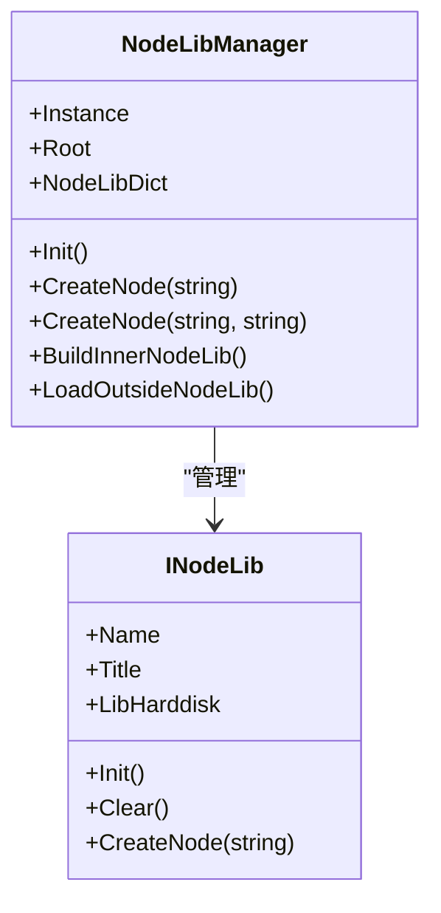

**图示来源**  
- [NodeLibManager.cs](file://XNode/SubSystem/NodeLibSystem/NodeLibManager.cs#L1-L30)
- [INodeLib.cs](file://XLib.Node/INodeLib.cs#L1-L33)

### 内置节点库构建
`BuildInnerNodeLib` 方法创建系统内置节点：

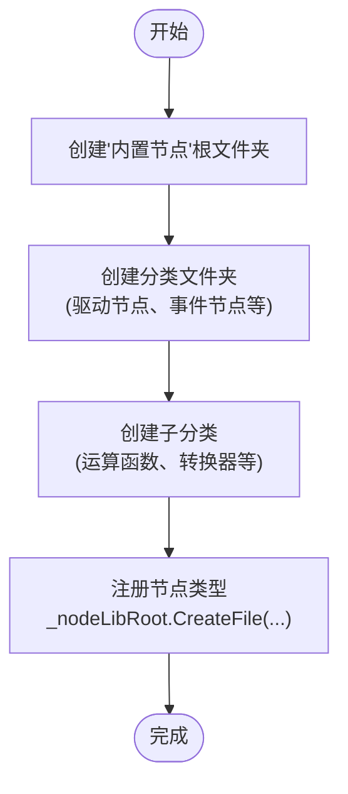

**图示来源**  
- [NodeLibManager.cs](file://XNode/SubSystem/NodeLibSystem/NodeLibManager.cs#L100-L150)

### 外部节点库加载
`LoadOutsideNodeLib` 方法动态加载外部DLL中的节点库：

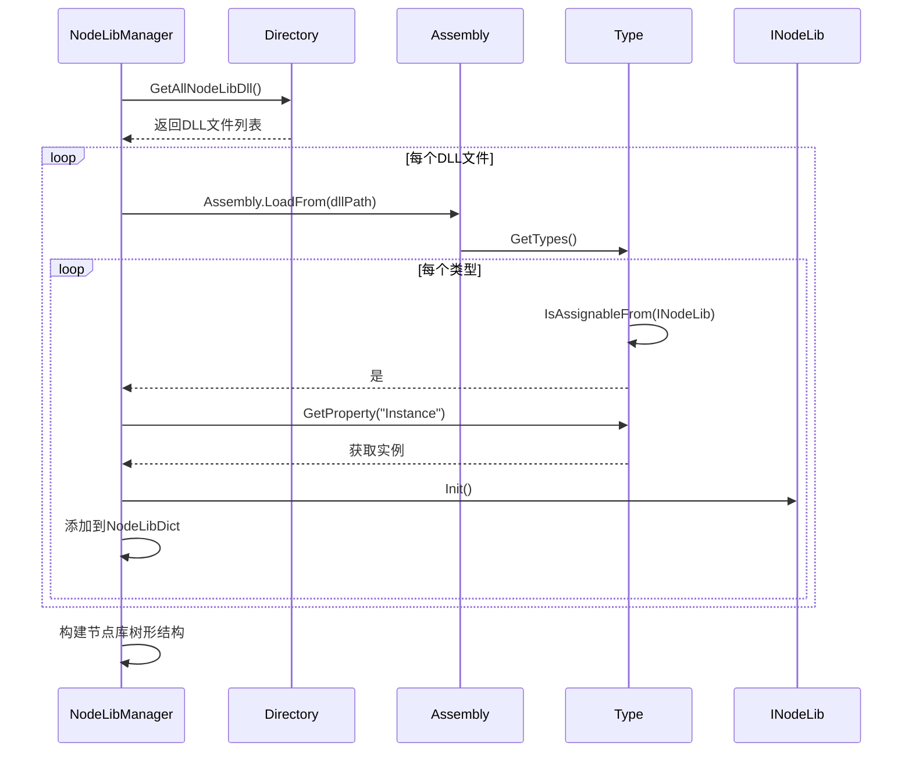

**图示来源**  
- [NodeLibManager.cs](file://XNode/SubSystem/NodeLibSystem/NodeLibManager.cs#L150-L200)

**本节来源**  
- [NodeLibManager.cs](file://XNode/SubSystem/NodeLibSystem/NodeLibManager.cs#L1-L222)
- [INodeLib.cs](file://XLib.Node/INodeLib.cs#L1-L33)

## 自定义节点开发流程
开发自定义节点的完整流程包括继承基类、定义引脚、实现逻辑和注册节点等步骤。

### 开发步骤
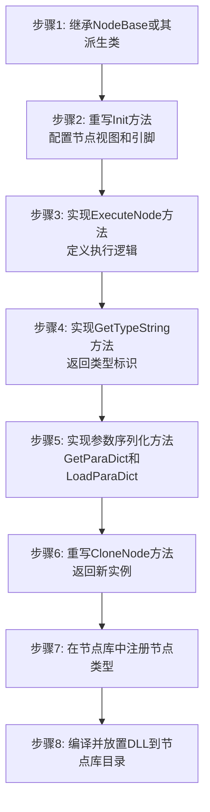

### 完整示例
```csharp
// 1. 定义自定义节点类
public class MyCustomNode : NodeBase
{
    // 2. 初始化节点
    public override void Init()
    {
        SetViewProperty(NodeColorSet.Custom, "Custom", "我的节点");
        
        // 3. 配置引脚
        PinGroupList.Add(new ExecutePinGroup(this, "执行流程"));
        PinGroupList.Add(new DataPinGroup(this, "string", "输入", "") { BoxWidth = 200 });
        PinGroupList.Add(new DataPinGroup(this, "string", "输出", "") { BoxWidth = 200, Writeable = false });
        
        InitPinGroup();
    }
    
    // 4. 实现执行逻辑
    protected override void ExecuteNode()
    {
        string input = GetData(1);
        string output = $"处理结果: {input.ToUpper()}";
        SetData(2, output);
        GetPinGroup<ExecutePinGroup>().Execute();
    }
    
    // 5. 类型标识
    public override string GetTypeString() => nameof(MyCustomNode);
    
    // 6. 参数管理
    public override Dictionary<string, string> GetParaDict() => 
        new Dictionary<string, string> { { "Input", GetData(1) } };
    
    public override void LoadParaDict(string version, Dictionary<string, string> paraDict)
    {
        SetData(1, paraDict.GetValueOrDefault("Input", ""));
    }
    
    // 7. 克隆实现
    protected override NodeBase CloneNode() => new MyCustomNode();
}
```

**本节来源**  
- [NodeBase.cs](file://XLib.Node/NodeBase.cs#L1-L418)
- [PinBase.cs](file://XLib.Node/PinBase.cs#L1-L80)
- [NodeType.cs](file://XLib.Node/NodeType.cs#L1-L40)

## 常见错误与调试
开发自定义节点时可能遇到的常见问题及解决方案。

### 常见错误类型
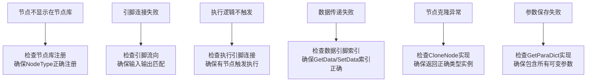

### 调试建议
1. **日志输出**: 在 `ExecuteNode` 中添加 `Console.WriteLine` 输出调试信息
2. **异常处理**: 使用 `try-catch` 包裹执行逻辑，通过 `InvokeExecuteError` 报告异常
3. **断点调试**: 在节点方法中设置断点，观察执行流程和数据状态
4. **参数验证**: 在 `LoadParaDict` 中添加参数验证逻辑，处理缺失或无效参数
5. **资源清理**: 在 `Clear` 方法中释放可能的资源引用，避免内存泄漏

**本节来源**  
- [NodeBase.cs](file://XLib.Node/NodeBase.cs#L1-L418)
- [Func_Log.cs](file://XNode/SubSystem/NodeLibSystem/Define/Functions/Func_Log.cs#L1-L42)
- [Func_Delay.cs](file://XNode/SubSystem/NodeLibSystem/Define/Functions/Func_Delay.cs#L1-L52)