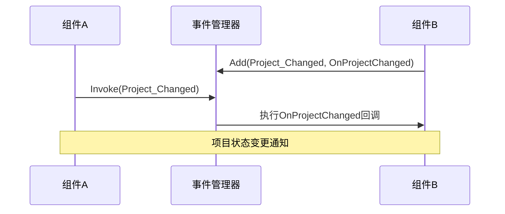
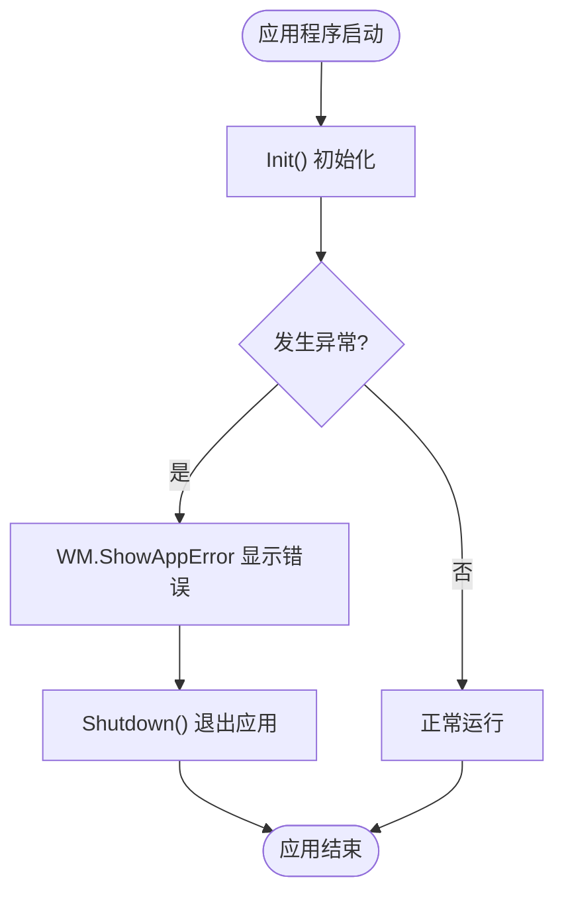
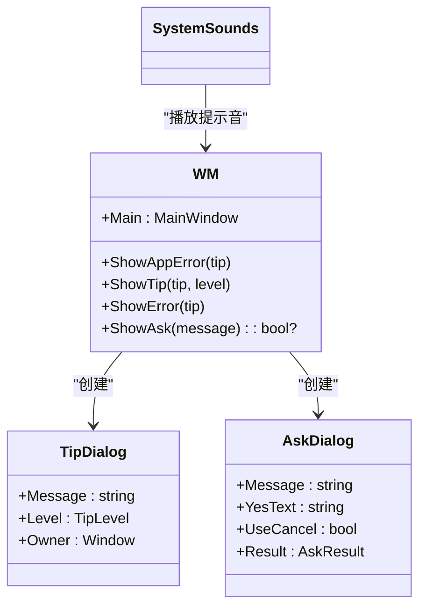
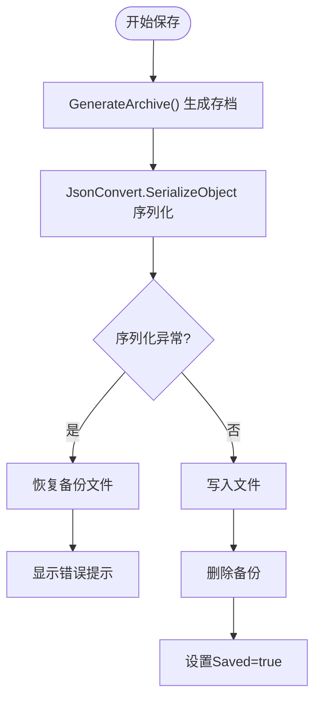
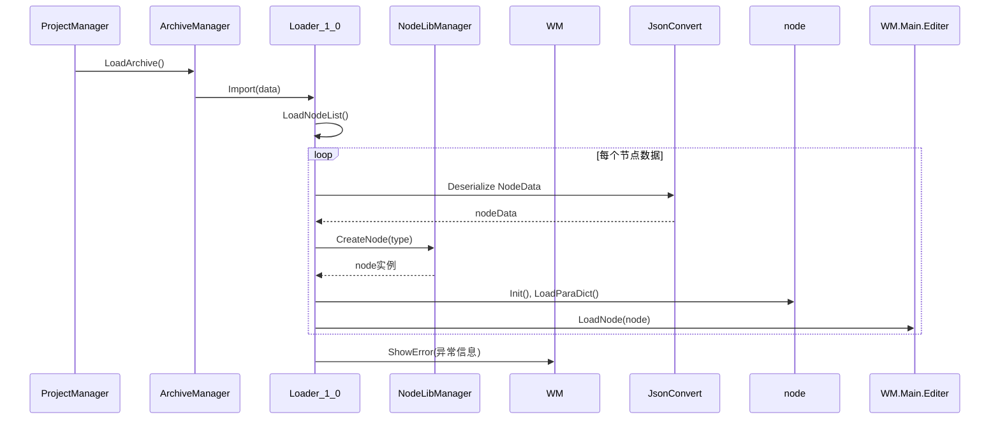
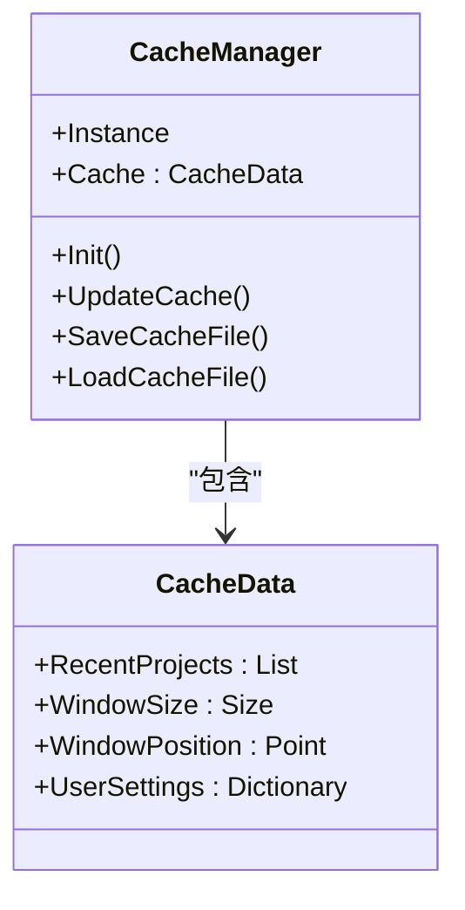

# 调试与维护

<cite>
**本文档引用的文件**  
- [App.xaml.cs](file://XNode/App.xaml.cs)
- [EM.cs](file://XLib.Base/EM.cs)
- [EM.cs](file://XNode/SubSystem/EventSystem/EM.cs)
- [EventType.cs](file://XNode/SubSystem/EventSystem/EventType.cs)
- [ArchiveManager.cs](file://XNode/SubSystem/ArchiveSystem/ArchiveManager.cs)
- [Loader_1_0.cs](file://XNode/SubSystem/ArchiveSystem/Loader/Loader_1_0.cs)
- [WM.cs](file://XNode/SubSystem/WindowSystem/WM.cs)
- [CacheManager.cs](file://XNode/SubSystem/CacheSystem/CacheManager.cs)
- [ProjectManager.cs](file://XNode/SubSystem/ProjectSystem/ProjectManager.cs)
- [NodeEditSystem](file://XNode/SubSystem/NodeEditSystem)
- [CoreEditer.xaml.cs](file://XNode/CoreEditer.xaml.cs)
</cite>

## 目录
1. [简介](#简介)
2. [事件系统与行为追踪](#事件系统与行为追踪)
3. [异常处理与错误提示](#异常处理与错误提示)
4. [存档与项目加载问题分析](#存档与项目加载问题分析)
5. [性能优化建议](#性能优化建议)
6. [日志记录策略](#日志记录策略)
7. [测试框架搭建](#测试框架搭建)

## 简介

本指南旨在为开发者提供全面的调试与维护支持，涵盖异常诊断、性能优化、日志记录和测试实践。通过深入分析核心组件，帮助开发者快速定位问题并提升系统稳定性。

## 事件系统与行为追踪

### 事件管理机制

XNode 使用基于泛型的事件管理系统（EM）实现松耦合的组件通信。该系统支持多种事件类型和参数化监听器，适用于节点创建、项目保存等关键操作的追踪。

```mermaid
classDiagram
class EM<T> {
+Init()
+Add(eventType, listener)
+Remove(eventType, listener)
+Clear(eventType)
+ClearAll()
+Invoke(eventType)
}
class EM {
+Instance
+Invoke(eventType)
+BeginInvoke(eventType)
}
class EventType {
+KeyDown
+KeyUp
+Project_Changed
+Project_Loaded
}
EM <|-- EM : "继承"
EM --> EventType : "使用"
```

**图示来源**  
- [EM.cs](file://XLib.Base/EM.cs#L1-L141)
- [EM.cs](file://XNode/SubSystem/EventSystem/EM.cs#L1-L62)
- [EventType.cs](file://XNode/SubSystem/EventSystem/EventType.cs#L1-L15)

#### 事件监听与触发流程



**图示来源**  
- [EM.cs](file://XNode/SubSystem/EventSystem/EM.cs#L30-L62)
- [ProjectManager.cs](file://XNode/SubSystem/ProjectSystem/ProjectManager.cs#L100-L110)

### 关键事件类型

| 事件类型 | 触发时机 | 典型用途 |
|---------|--------|--------|
| `Project_Changed` | 项目状态变更（如保存状态） | 更新UI标题、启用/禁用保存按钮 |
| `Project_Loaded` | 项目加载完成 | 初始化编辑器状态、刷新视图 |
| `KeyDown` / `KeyUp` | 键盘输入 | 快捷键处理、交互控制 |

**节来源**  
- [EventType.cs](file://XNode/SubSystem/EventSystem/EventType.cs#L1-L15)
- [ProjectManager.cs](file://XNode/SubSystem/ProjectSystem/ProjectManager.cs#L80-L130)

## 异常处理与错误提示

### 启动异常捕获机制

在 `App.xaml.cs` 中实现了应用程序启动阶段的异常捕获，确保即使初始化失败也能优雅地提示用户并安全退出。



**图示来源**  
- [App.xaml.cs](file://XNode/App.xaml.cs#L15-L45)

### 错误提示系统

`WM.ShowAppError` 方法通过 `TipDialog` 提供统一的错误提示界面，并配合系统声音增强用户体验。



**图示来源**  
- [WM.cs](file://XNode/SubSystem/WindowSystem/WM.cs#L1-L85)

**节来源**  
- [App.xaml.cs](file://XNode/App.xaml.cs#L15-L45)
- [WM.cs](file://XNode/SubSystem/WindowSystem/WM.cs#L1-L85)

## 存档与项目加载问题分析

### 存档序列化失败处理

`ArchiveManager.Archive` 在序列化过程中可能因数据结构不兼容或JSON格式错误导致异常。系统通过异常捕获和用户提示进行处理。



**图示来源**  
- [ArchiveManager.cs](file://XNode/SubSystem/ArchiveSystem/ArchiveManager.cs#L50-L136)
- [ProjectManager.cs](file://XNode/SubSystem/ProjectSystem/ProjectManager.cs#L200-L250)

### 项目加载错误诊断

`Loader_1_0.Import` 方法负责从存档数据中还原节点和连接线。常见问题包括节点类型不存在、引脚路径无效等。



**图示来源**  
- [Loader_1_0.cs](file://XNode/SubSystem/ArchiveSystem/Loader/Loader_1_0.cs#L1-L81)
- [ArchiveManager.cs](file://XNode/SubSystem/ArchiveSystem/ArchiveManager.cs#L90-L130)

**节来源**  
- [ArchiveManager.cs](file://XNode/SubSystem/ArchiveSystem/ArchiveManager.cs#L50-L136)
- [Loader_1_0.cs](file://XNode/SubSystem/ArchiveSystem/Loader/Loader_1_0.cs#L1-L81)
- [WM.cs](file://XNode/SubSystem/WindowSystem/WM.cs#L50-L60)

## 性能优化建议

### 减少不必要的UI更新

避免在高频操作（如动画、拖拽）中频繁触发UI重绘。建议使用 `BeginInvoke` 延迟更新或批量处理变更。

```csharp
// 推荐：批量更新后统一触发
EM.Instance.BeginInvoke(EventType.Project_Changed);
```

### 合理使用缓存

`CacheManager` 提供了持久化缓存机制，可用于存储用户偏好、最近打开项目列表等。



**图示来源**  
- [CacheManager.cs](file://XNode/SubSystem/CacheSystem/CacheManager.cs#L1-L83)

### 控制节点数量与内存管理

- **限制节点总数**：在 `NodeEditSystem` 中设置最大节点数阈值
- **延迟加载**：对于大型项目，采用分页或区域加载策略
- **及时释放资源**：关闭项目时重置编辑器状态

```csharp
// 关闭项目时释放资源
WM.Main.Editer.ResetEditer();
```

**节来源**  
- [CacheManager.cs](file://XNode/SubSystem/CacheSystem/CacheManager.cs#L1-L83)
- [CoreEditer.xaml.cs](file://XNode/CoreEditer.xaml.cs)
- [ProjectManager.cs](file://XNode/SubSystem/ProjectSystem/ProjectManager.cs#L150-L170)

## 日志记录策略

建议在关键路径添加 `Trace` 输出，便于调试和问题追踪：

- **节点创建/销毁**：记录节点类型和ID
- **存档操作**：记录序列化前后的时间戳
- **异常处理**：记录完整的异常堆栈信息

```csharp
// 示例：在节点加载时添加跟踪
Trace.WriteLine($"[Loader_1_0] 正在加载节点: {nodeBaseData.TypeString} (ID: {nodeBaseData.ID})");
```

**节来源**  
- [Loader_1_0.cs](file://XNode/SubSystem/ArchiveSystem/Loader/Loader_1_0.cs#L10-L80)
- [ArchiveManager.cs](file://XNode/SubSystem/ArchiveSystem/ArchiveManager.cs#L90-L130)

## 测试框架搭建

### 单元测试

使用 `xUnit` 或 `NUnit` 对核心逻辑进行测试：

- `ArchiveManager` 的版本比较逻辑
- `Loader_1_0` 的节点反序列化
- `EM` 事件系统的监听与触发

### UI自动化测试

利用 `Microsoft UI Automation` 或 `TestStack.White` 实现：

- 模拟用户操作（创建节点、连接引脚）
- 验证UI状态变更（项目保存状态、错误提示）

**节来源**  
- [ArchiveManager.cs](file://XNode/SubSystem/ArchiveSystem/ArchiveManager.cs)
- [Loader_1_0.cs](file://XNode/SubSystem/ArchiveSystem/Loader/Loader_1_0.cs)
- [EM.cs](file://XNode/SubSystem/EventSystem/EM.cs)