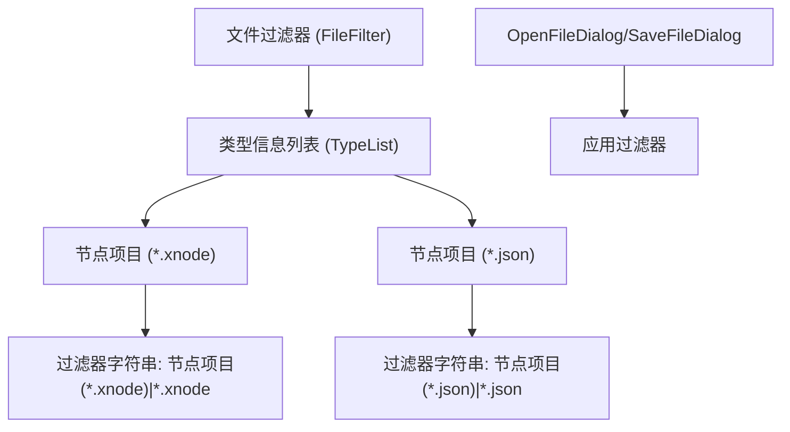

# 附录

<cite>
**本文档中引用的文件**  
- [LICENSE.txt](file://LICENSE.txt)
- [README.md](file://README.md)
- [XLib.Base/FileFilter.cs](file://XLib.Base/FileFilter.cs)
- [XNode/SubSystem/ProjectSystem/FileTool.cs](file://XNode/SubSystem/ProjectSystem/FileTool.cs)
- [XNode/SubSystem/ArchiveSystem/ArchiveManager.cs](file://XNode/SubSystem/ArchiveSystem/ArchiveManager.cs)
- [XNode/SubSystem/ArchiveSystem/Define/Data_1_0/Data_1_0.cs](file://XNode/SubSystem/ArchiveSystem/Define/Data_1_0/Data_1_0.cs)
- [XNode/SubSystem/ArchiveSystem/Loader/Loader_1_0.cs](file://XNode/SubSystem/ArchiveSystem/Loader/Loader_1_0.cs)
- [XNode/SubSystem/OptionSystem/OptionManager.cs](file://XNode/SubSystem/OptionSystem/OptionManager.cs)
</cite>

## 目录
1. [文件目录说明](#文件目录说明)
2. [常见问题解答（FAQ）](#常见问题解答faq)
3. [贡献指南](#贡献指南)
4. [项目依赖项](#项目依赖项)
5. [文件过滤器支持的扩展名](#文件过滤器支持的扩展名)
6. [许可证信息](#许可证信息)

## 文件目录说明

本项目采用模块化结构设计，各主要模块文件夹用途如下：

- **NodeLib.File**：文件操作相关的节点库模块，包含文件重命名（Rename）、获取文件MD5值等功能节点。
- **XLib.Animate**：动画功能模块，提供动画引擎、动画队列、动画组等核心动画控制类，支持延迟、缓动等动画效果。
- **XLib.Base**：基础功能库，包含应用框架、归档框架、驱动接口、扩展方法、ID管理、虚拟磁盘系统、文件过滤器（FileFilter）、高精度定时器等通用组件。
- **XLib.Drawing**：绘图基础模块，提供位图（Bitmap）和像素（Pixel）级别的图像处理能力。
- **XLib.Math**：数学计算模块，包含缓动函数（Easing）、数值范围（Range）等数学工具。
- **XLib.Node**：节点系统基础模块，定义了节点（NodeBase）、引脚（PinBase）、节点类型、节点属性等核心数据结构。
- **XLib.Sample**：示例应用程序，展示如何使用XLib库构建基本应用界面。
- **XLib.WPF**：WPF平台适配模块，包含行为树（Behavior）、绘图板（DrawingBoard）、窗口定义（XMainWindow等）及UI扩展功能。
- **XLib.WPFControl**：WPF控件库，提供进度条、工具栏、树形控件等可视化组件。
- **XLib.WPFStyle**：WPF样式转换器集合，用于UI样式绑定。
- **XNode**：主应用程序模块，包含多个子系统：
  - **AppTool**：应用级工具类，如项目、系统、应用委托等。
  - **SubSystem**：核心子系统集合，包括：
    - **ArchiveSystem**：存档系统，负责项目数据的序列化与反序列化。
    - **CacheSystem**：缓存管理，提升性能。
    - **ControlSystem**：控制引擎，处理用户交互逻辑。
    - **EventSystem**：事件管理，处理应用内事件分发。
    - **NodeEditSystem**：节点编辑系统，提供可视化编辑界面。
    - **NodeLibSystem**：节点库管理系统，加载和管理各类功能节点。
    - **OptionSystem**：选项管理，存储用户配置和路径设置。
    - **ProjectSystem**：项目管理，处理项目文件的打开与保存。
    - **ResourceSystem**：资源管理，管理图标、光标、图像等资源。
    - **TimerSystem**：定时器系统，支持高精度时间调度。
    - **WindowSystem**：窗口管理，控制对话框和主窗口行为。

**Section sources**
- [XLib.Animate](file://XLib.Animate)
- [XNode/SubSystem](file://XNode/SubSystem)

## 常见问题解答（FAQ）

### 如何重置窗口布局？

当前版本未提供一键重置布局的功能。若需恢复默认布局，可手动删除用户文档目录下的 `XNode\` 配置文件夹（路径通常为 `文档\XNode\`），重启应用后将重建默认配置。

### 为何无法加载旧版项目？

项目加载失败可能由以下原因导致：
1. **版本不兼容**：存档版本过新或过旧。系统仅支持当前版本及更早版本的项目文件。若提示“存档版本过新”，请升级软件。
2. **文件损坏**：项目文件（.xnode）内容被破坏或格式错误。
3. **路径问题**：项目文件路径包含非法字符或权限不足。

相关代码逻辑位于 `ArchiveManager.LoadArchive` 方法中，会检查版本并调用对应加载器。

**Section sources**
- [XNode/SubSystem/ArchiveSystem/ArchiveManager.cs#L50-L136](file://XNode/SubSystem/ArchiveSystem/ArchiveManager.cs#L50-L136)
- [XNode/SubSystem/ArchiveSystem/Loader/Loader_1_0.cs#L10-L81](file://XNode/SubSystem/ArchiveSystem/Loader/Loader_1_0.cs#L10-L81)

### 如何添加自定义图标？

自定义图标可通过 `ResourceSystem` 模块管理。具体步骤如下：
1. 将图标文件（如PNG、ICO）放入资源目录。
2. 使用 `PinIconManager` 或 `ImageResManager` 注册图标资源。
3. 在节点定义中通过 `PinIconTool` 关联图标与引脚类型。

相关类位于 `XNode/SubSystem/ResourceSystem/` 目录下。

**Section sources**
- [XNode/SubSystem/ResourceSystem](file://XNode/SubSystem/ResourceSystem)

## 贡献指南

欢迎社区开发者参与项目贡献。请遵循以下规范：

### 代码风格规范
- 使用 C# 语言编写，遵循 .NET 命名约定。
- 类名采用 PascalCase，私有字段以下划线 `_` 开头。
- 方法内部逻辑清晰，关键步骤添加中文注释。
- 避免长函数，单个方法建议不超过 50 行。

### 提交流程
1. Fork 本仓库。
2. 创建功能分支（如 `feature/custom-icon`）。
3. 提交代码并确保通过本地测试。
4. 提交 Pull Request，描述变更内容与目的。

### 社区联系方式
如有问题或建议，欢迎加入 QQ 群交流：**895857206**

**Section sources**
- [README.md](file://README.md)

## 项目依赖项

本项目依赖以下第三方库：

- **Newtonsoft.Json**：用于项目文件的 JSON 序列化与反序列化，版本要求不低于 13.0.0。
- **WPF (Windows Presentation Foundation)**：UI 框架，.NET Framework 4.7.2 或 .NET 6+ WPF 支持。

这些依赖通过 NuGet 包管理器引入，确保开发环境已安装对应 SDK。

**Section sources**
- [XNode/SubSystem/ArchiveSystem/ArchiveManager.cs#L1-L5](file://XNode/SubSystem/ArchiveSystem/ArchiveManager.cs#L1-L5)

## 文件过滤器支持的扩展名

`FileTool` 类中定义了项目文件的过滤规则，支持以下扩展名：

- **.xnode**：原生节点项目文件格式。
- **.json**：通用 JSON 格式项目文件（兼容性支持）。

该配置由 `FileFilter` 类实现，用于打开和保存对话框的文件类型筛选。



**Diagram sources**
- [XNode/SubSystem/ProjectSystem/FileTool.cs#L10-L20](file://XNode/SubSystem/ProjectSystem/FileTool.cs#L10-L20)
- [XLib.Base/FileFilter.cs](file://XLib.Base/FileFilter.cs)

**Section sources**
- [XNode/SubSystem/ProjectSystem/FileTool.cs](file://XNode/SubSystem/ProjectSystem/FileTool.cs)
- [XLib.Base/FileFilter.cs](file://XLib.Base/FileFilter.cs)

## 许可证信息

### MIT 许可证全文

```
MIT License

Copyright (c) [year] [fullname]

特此授予任何获得本软件及相关文档文件（“软件”）副本的人无限制使用本软件的权利，包括使用、复制、修改、合并、发布、分发、再许可和/或销售本软件副本的权利，前提是满足以下条件：

上述版权声明和本许可声明必须包含在本软件的所有副本或重要部分中。

本软件按“原样”提供，不提供任何形式的明示或暗示保证，包括但不限于适销性、特定用途适用性和非侵权保证。在任何情况下，作者或版权持有人均不对因使用或无法使用本软件而引起的任何索赔、损害或其他责任负责，无论是在合同、侵权行为还是其他行为中产生的。
```

### 使用条款摘要
- ✅ 允许：商业使用、分发、修改、专利使用、私用。
- 🔄 条件：分发时必须包含原始版权和许可声明。
- ❌ 不提供：责任担保、商标使用授权。
- 🆓 无需支付许可费用。

**Section sources**
- [LICENSE.txt](file://LICENSE.txt)