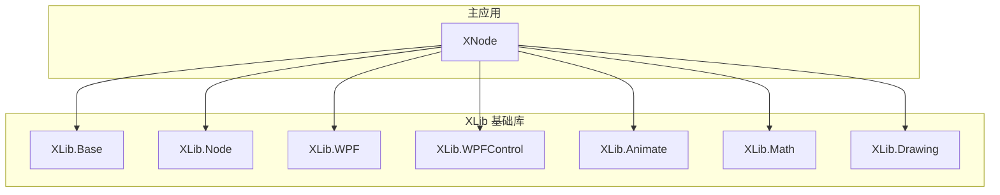
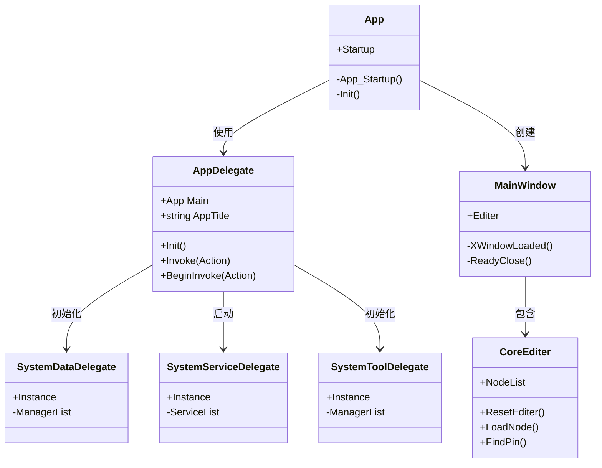
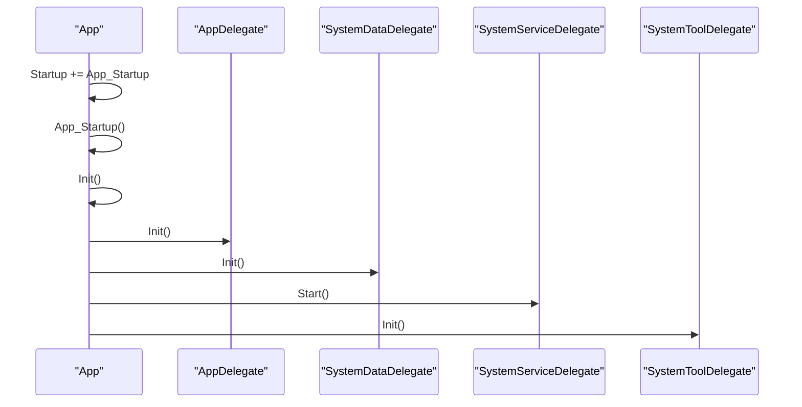
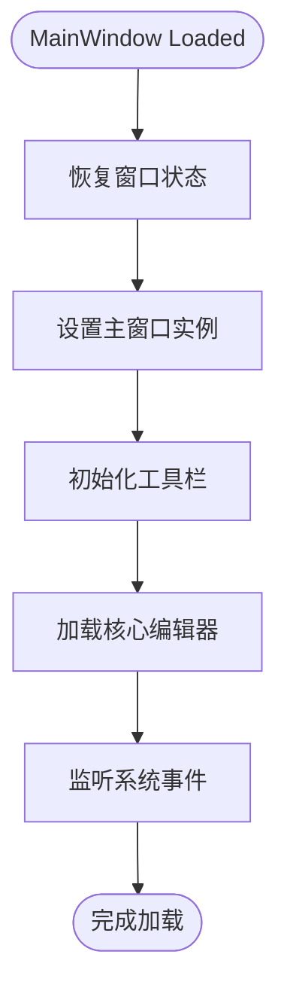
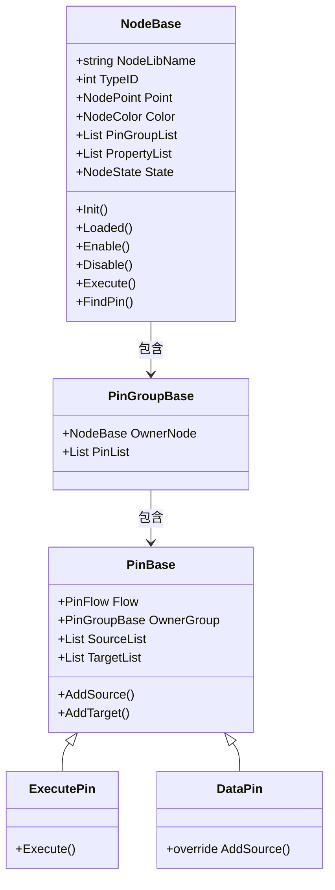
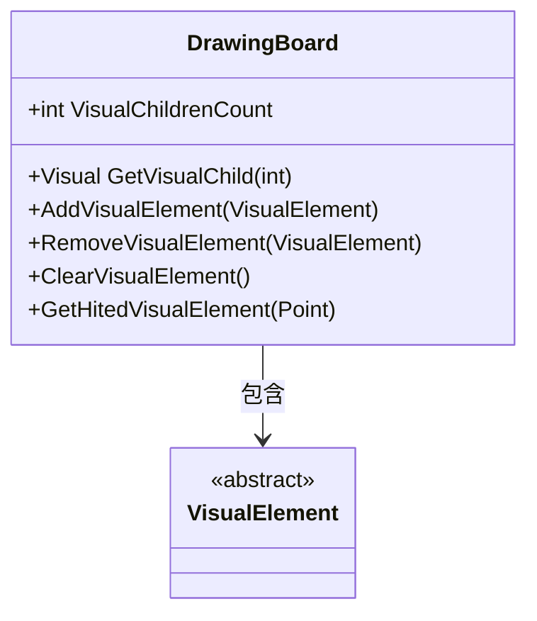
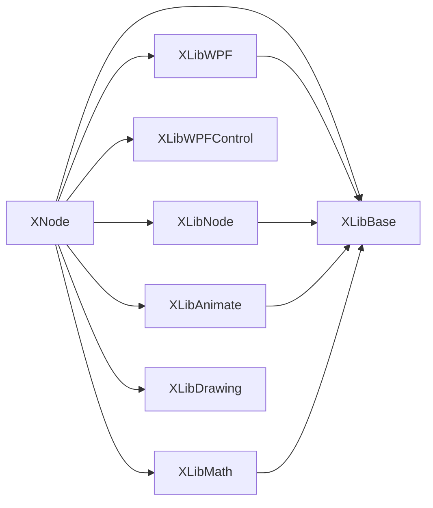

# 项目概述

<cite>
**本文档引用的文件**
- [App.xaml.cs](file://XNode/App.xaml.cs)
- [MainWindow.xaml.cs](file://XNode/MainWindow.xaml.cs)
- [CoreEditer.xaml.cs](file://XNode/CoreEditer.xaml.cs)
- [AppDelegate.cs](file://XNode/AppTool/AppDelegate.cs)
- [SystemDelegate.cs](file://XNode/AppTool/SystemDelegate.cs)
- [NodeBase.cs](file://XLib.Node/NodeBase.cs)
- [PinBase.cs](file://XLib.Node/PinBase.cs)
- [DrawingBoard.cs](file://XLib.WPF/Drawing/DrawingBoard.cs)
</cite>

## 目录
1. [引言](#引言)
2. [项目结构](#项目结构)
3. [核心组件](#核心组件)
4. [架构概览](#架构概览)
5. [详细组件分析](#详细组件分析)
6. [依赖分析](#依赖分析)
7. [性能考虑](#性能考虑)
8. [故障排除指南](#故障排除指南)
9. [结论](#结论)

## 引言

XNode 是一个基于 WPF 的可视化节点编辑器桌面应用程序，旨在为用户提供图形化编程环境。通过拖拽节点并连接引脚，用户可以构建复杂的逻辑流程图，适用于游戏开发中的行为树设计、自动化脚本编排以及数据流处理等场景。该项目采用 C# 语言开发，基于 .NET Framework 和 WPF UI 框架，使用 Newtonsoft.Json 进行项目序列化。整体架构采用组件化设计与 MVC 变体模式，具备良好的扩展性和可维护性。

## 项目结构

XNode 项目由多个模块组成，主要包括主应用 XNode 和多个基础库 XLib 系列。这些库分别负责不同功能领域，如节点逻辑、动画系统、UI 控件、资源管理等。

**图示来源**
- [XNode](file://XNode)
- [XLib.Base](file://XLib.Base)
- [XLib.Node](file://XLib.Node)
- [XLib.WPF](file://XLib.WPF)

**本节来源**
- [XNode](file://XNode)
- [XLib.Base](file://XLib.Base)

## 核心组件

XNode 的核心组件包括应用程序入口、主窗口、核心编辑器、节点系统和引脚系统。这些组件共同构成了可视化编程的基础能力。

**本节来源**
- [App.xaml.cs](file://XNode/App.xaml.cs)
- [MainWindow.xaml.cs](file://XNode/MainWindow.xaml.cs)
- [CoreEditer.xaml.cs](file://XNode/CoreEditer.xaml.cs)
- [NodeBase.cs](file://XLib.Node/NodeBase.cs)
- [PinBase.cs](file://XLib.Node/PinBase.cs)

## 架构概览

XNode 采用组件化 + MVC 变体的架构风格。各子系统通过代理模式进行协调，实现了高内聚低耦合的设计目标。

**图示来源**
- [App.xaml.cs](file://XNode/App.xaml.cs#L1-L60)
- [AppDelegate.cs](file://XNode/AppTool/AppDelegate.cs#L1-L28)
- [SystemDelegate.cs](file://XNode/AppTool/SystemDelegate.cs#L1-L60)
- [MainWindow.xaml.cs](file://XNode/MainWindow.xaml.cs#L1-L199)
- [CoreEditer.xaml.cs](file://XNode/CoreEditer.xaml.cs#L1-L72)

## 详细组件分析

### 应用程序启动流程分析

XNode 的启动流程从 `App.xaml.cs` 开始，通过事件驱动方式完成初始化。

**图示来源**
- [App.xaml.cs](file://XNode/App.xaml.cs#L15-L60)
- [AppDelegate.cs](file://XNode/AppTool/AppDelegate.cs#L15-L28)
- [SystemDelegate.cs](file://XNode/AppTool/SystemDelegate.cs#L10-L60)

### 主窗口结构分析

主窗口继承自 `XMainWindow`，负责加载核心编辑器、初始化工具栏，并监听系统事件。

**图示来源**
- [MainWindow.xaml.cs](file://XNode/MainWindow.xaml.cs#L30-L199)

### 节点系统分析

节点系统是 XNode 的核心逻辑单元，所有功能节点均继承自 `NodeBase` 类。

**图示来源**
- [NodeBase.cs](file://XLib.Node/NodeBase.cs#L1-L199)
- [PinBase.cs](file://XLib.Node/PinBase.cs#L1-L79)

### 绘图系统分析

绘图系统基于 WPF 的 `FrameworkElement` 实现，支持可视元素的添加、移除和命中检测。

**图示来源**
- [DrawingBoard.cs](file://XLib.WPF/Drawing/DrawingBoard.cs#L1-L94)

## 依赖分析

XNode 项目采用分层依赖结构，主应用依赖于各个 XLib 基础库，各基础库之间保持松耦合。

**图示来源**
- [XNode](file://XNode)
- [XLib.Base](file://XLib.Base)
- [XLib.Node](file://XLib.Node)
- [XLib.WPF](file://XLib.WPF)

## 性能考虑

XNode 在性能方面做了多项优化：
- 使用 `HighPrecisionTimer` 提供高精度定时服务
- 通过 `CacheManager` 缓存窗口状态和用户偏好
- 利用 WPF 的 `VisualTreeHelper` 进行高效命中检测
- 采用事件系统（EM）减少对象间直接依赖

## 故障排除指南

常见问题及解决方案：
- **启动异常**：检查 `AppDelegate.Init()` 是否成功获取 `Application.Current`
- **节点无法执行**：确认节点状态为启用且引脚连接正确
- **UI 响应迟缓**：检查动画引擎和控制引擎是否正常运行
- **项目保存失败**：验证序列化逻辑和文件路径权限

**本节来源**
- [App.xaml.cs](file://XNode/App.xaml.cs#L20-L35)
- [NodeBase.cs](file://XLib.Node/NodeBase.cs#L150-L170)
- [SystemDelegate.cs](file://XNode/AppTool/SystemDelegate.cs#L20-L50)

## 结论

XNode 是一个结构清晰、扩展性强的可视化节点编辑器。其基于 WPF 的图形界面提供了流畅的用户体验，组件化架构使得功能扩展变得简单。对于初学者，建议先掌握 C#、WPF 和 JSON 序列化基础知识，然后从 `NodeBase` 和 `PinBase` 类入手理解节点系统的工作原理。通过学习 `AppDelegate` 和 `SystemDelegate` 的设计，可以深入理解项目的整体架构和生命周期管理机制。